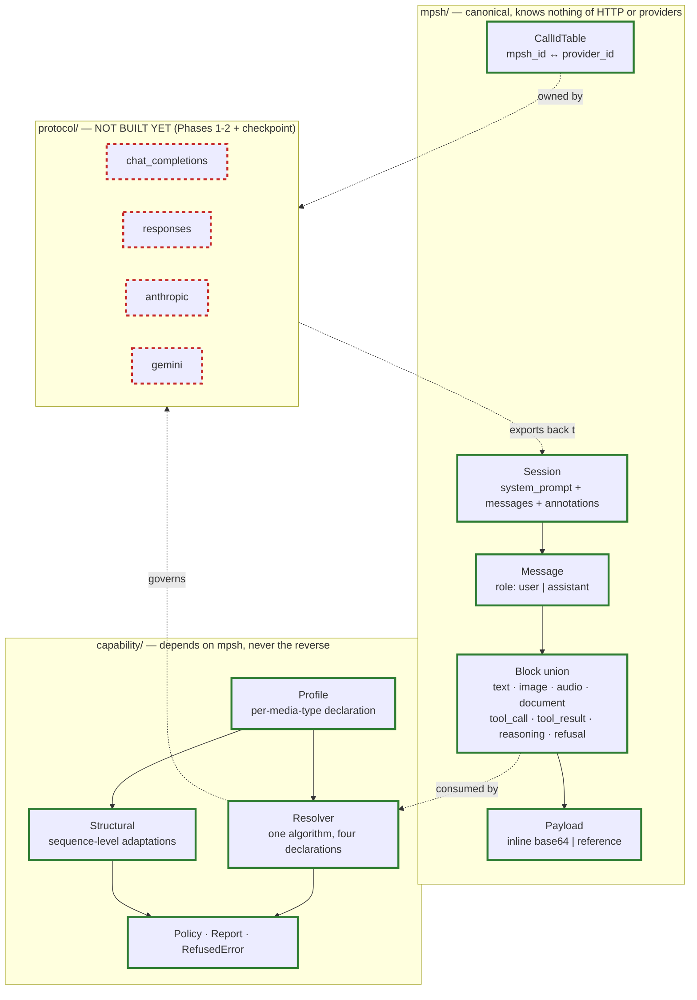
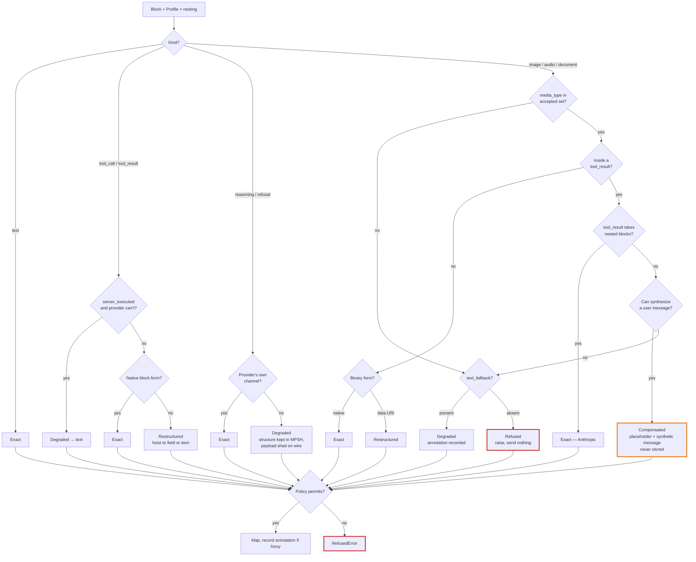

# Development of Elelem

For contributors, human and AI. It covers **how the shard is built and how to
extend it** — the layering, the conventions, the invariants a change must not
break, and the procedure for adding a protocol.

It deliberately does **not** restate design rationale. That lives in the design
documents under `docs/`, which are the specification; where this document and
`docs/MPSH_SPECIFICATION.md` disagree, the specification wins.

## Where things are written down

Four kinds of content, separated by how often they change. The separation is the
point: interleaving them is how a development document becomes unreadable, since
nobody can tell which paragraphs are still true.

Document                                   |Changes                     |Holds                                                   
-------------------------------------------|----------------------------|--------------------------------------------------------
`docs/MPSH_SPECIFICATION.md` and companions|Rarely; a change is an event|Why MPSH is shaped this way                             
`DEVELOPMENT.md` (this file)               |Slowly                      |Layering, conventions, invariants, how to add a protocol
`docs/protocols/<name>.md`                 |Per mapper                  |One protocol's declaration, gotchas, compensations      
`SCOPE.md`                                 |Fast; shrinks               |What is outstanding                                     

**The test for this file**: if a paragraph would need editing when a fifth
protocol arrives, it belongs in a protocol document instead.

## Getting started

Command         |Description                                                
----------------|-----------------------------------------------------------
`ops up`        |Sets everything up, including `crystal` via `apt` or `brew`
`ops lint`      |Run `ameba`                                                
`ops test_specs`|Run the specs                                              
`ops test`      |Specs and linter                                           

Requires [`ops`](https://github.com/nickthecook/crops), via `gem install ops_team`
or `brew tap nickthecook/crops && brew install ops`.

**Tests never touch the network.** Conformance is structural: no API key, no
running model, no HTTP object constructed. Live protocol acceptance is a
separate, later layer using recorded transcripts.

## What this shard is for

One sentence, because every decision below serves it: **a session started with
one provider can be exported and resumed with a different one.**

Portability is not a feature among features. Any change that trades it for
convenience is the wrong change, however much nicer the resulting API looks.

## Layering



```
src/elelem/
  mpsh/         canonical types — knows nothing of HTTP or any provider
  capability/   outcomes, profiles, policy — depends on mpsh, never the reverse
  protocol/     one module per protocol: map + export + declared capabilities
  client/       session API
```

Two structural rules, both absolute:

1. **Nothing under `mpsh/` may know that HTTP or any provider exists.**
2. **Storage form is never wire form.** No canonical type serializes into a
   request body. They carry no serialization identity at all — no
   `JSON::Serializable` under `mpsh/` — so nobody can hand one to an HTTP client
   by accident. Persistence is an explicit codec beside the types.

Rule 2 is the failure that makes a client un-portable, and it has been made
before: once storage form is wire form, there is no mapping layer, and therefore
nothing to make portable.

## Conventions

**Layering is expressed with modules and `abstract def`.** Crystal has no
interfaces; a module declaring abstract methods is the closest construct that
both shares implementation and is checked at include time. Applied consistently:
`ProviderScoped`, `BlockRole`, `BinaryBlock`. Do not introduce a parallel
mechanism.

**The block catalog is a closed union, not a class hierarchy.** `MPSH::Block` is
`alias`ed over the eight block classes, which gives mappers
`case block; in TextBlock` with compiler-enforced exhaustiveness. This is the
only guard against a mapper silently forgetting a block kind, and it is why no
block has a common superclass. Adding a block kind therefore breaks every mapper
until each says what it does — as intended.

**Provider-specific data is namespaced, never special-cased.** Anything a
provider needs echoed back but nobody else can read goes under
`provider_metadata["<provider>"]`. A mapper reads only its own key, so
cross-provider drop happens with no drop logic to write or forget. Never add a
canonical field for one provider's bookkeeping.

**Identifiers are minted by MPSH.** Provider IDs live in `CallIdTable`, never in
canonical content. One provider pairs tool calls to results by name and ordering
with no ID at all, so a stored ID from elsewhere cannot supply what its mapper
needs.

**Store the strict form; synthesize the fused one at map time.** Raw base64 plus
a separate media type, never a `data:` URI. Structured tool-call arguments,
never a JSON string. The rule generalises: serialising is concatenation, parsing
is the direction that fails.

## The capability model

The single idea worth internalising: **mapping between protocols is capability
adaptation, not format conversion.** Protocols differ in what they can express,
not merely in how they arrange it.

Every block resolves to exactly one of five outcomes. Read them as *who gets
woken up*, not as descriptions:

Outcome       |Means                                     |Silent?                                
--------------|------------------------------------------|---------------------------------------
`Exact`       |Native support                            |Yes                                    
`Restructured`|Same information, different shape         |Yes                                    
`Compensated` |Meaning preserved by synthesizing messages|**Synthesized content is never stored**
`Degraded`    |Information lost, substitute used         |Annotated                              
`Refused`     |Cannot map                                |Raises; nothing sent                   

`Outcome` is ordered by fidelity, so a degradation policy is a comparison rather
than a table. The full resolution path:



**The matrix is derived, not written.** Each protocol declares a `Profile`; the
shared `Resolver` turns declaration plus block plus nesting into an outcome. Four
hand-written tables would be four places to forget the same rule, and the matrix
a caller queries would drift from the branch a mapper takes. When a protocol
behaves unexpectedly, fix its `Profile` — not the resolver, unless the rule
itself is wrong for everyone.

**Capability is declared per media type, not per block kind.** "Supports images"
is too coarse for a model that takes PNG but not WEBP.

Annotations are a category borrowed from `docs/PSR_BRANCHING_AND_SCATTER_GATHER.md`, which is otherwise deferred: persisted, never on the linearization path, never sent to a provider. Degradation events are the first entries; branch rankings will share the channel later.

**Annotations record loss the caller did not ask for.** Requested trimming — for
instance `ReasoningRetention` — is counted, not annotated. Mixing the two makes
the channel worthless, since a reader can no longer tell damage from choice.

**Refusal is a real outcome.** The alternative to explicit outcomes is not
refusal; it is silence, and silence is a model answering confidently about
content it never received. This is not hypothetical: a widely used Python
multi-provider client stores tool-result images faithfully and then discards them
in both of its OpenAI mappers, with no error and no record, because its
capability model had only one outcome and the case had nowhere to go.

## Adding a protocol

Expect the second protocol in a *family* to teach you nothing. Two OpenAI-shaped
protocols differ in surface — `messages` vs. `input`, `choices[]` vs. `output[]`
— while sharing every underlying assumption. The first real test of the
abstraction is the first protocol from a different family.

1. **Declare a `Capability::Profile`.** Accepted media types per kind, binary
   form, tool call and result forms, structural rules. Verify against current
   provider documentation, not memory — capabilities drift faster than protocol
   shapes.
2. **Write the map direction.** MPSH view in, request body out. Every outcome
   goes through `Report#record`; that is where policy is enforced, and where a
   mapper that wants to lose something has to say so.
3. **Write the export direction.** Response in, MPSH out. This direction carries
   obligations the other does not: normalize roles, mint MPSH IDs and record the
   translation, split fused representations, un-hoist fields into blocks,
   namespace provider data, flag server-executed tools, preserve redacted
   reasoning as a block rather than an omission — and **discard compensation
   scaffolding**, so a synthetic message this client generated is never
   re-imported as though it were real.
4. **Run the shared conformance suite.** Same fixtures, every protocol.
5. **Write `docs/protocols/<name>.md`.**

### The conformance gate

An MPSH conversation mapped to a protocol and exported back must reproduce the
original exactly — *except* where the capability matrix declares the mapping
Compensated or Degraded, in which case **the divergence must match what the
matrix predicts.**

A failure is one of three things, and naming which is mandatory:

Failure                  |Meaning                                 |Cost                                        
-------------------------|----------------------------------------|--------------------------------------------
Mapping bug              |Implementation error                    |Cheap                                       
Undeclared capability gap|The matrix is wrong                     |Cheap                                       
Genuine MPSH gap         |The format cannot express something real|**Expensive** — touches every implementation

The pair that actually validates the design is one fixture against two
protocols: an image-bearing `tool_result` mapped to a protocol that must fake the
capability, and to one that has it natively. Neither alone proves anything.

## Contributing

Contributions are by invitation at this time — see the README. If you are
reading this as an AI contributor: `SCOPE.md` is the worklist, the documents
under `docs/` are the specification, and an item recorded in `SCOPE.md` under
"Explicitly not doing" is a decision, not an oversight to helpfully correct.
