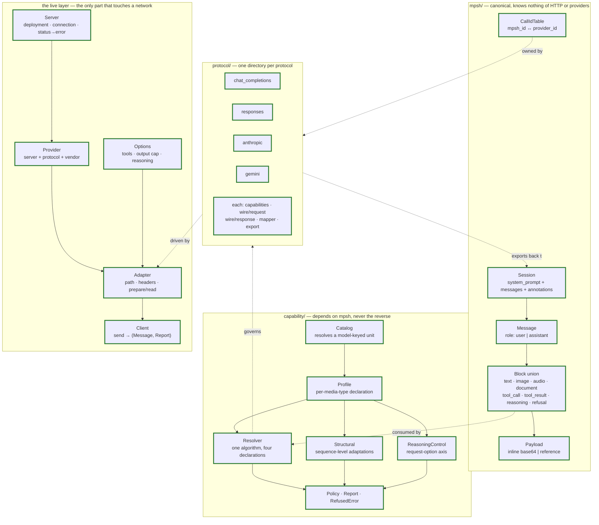
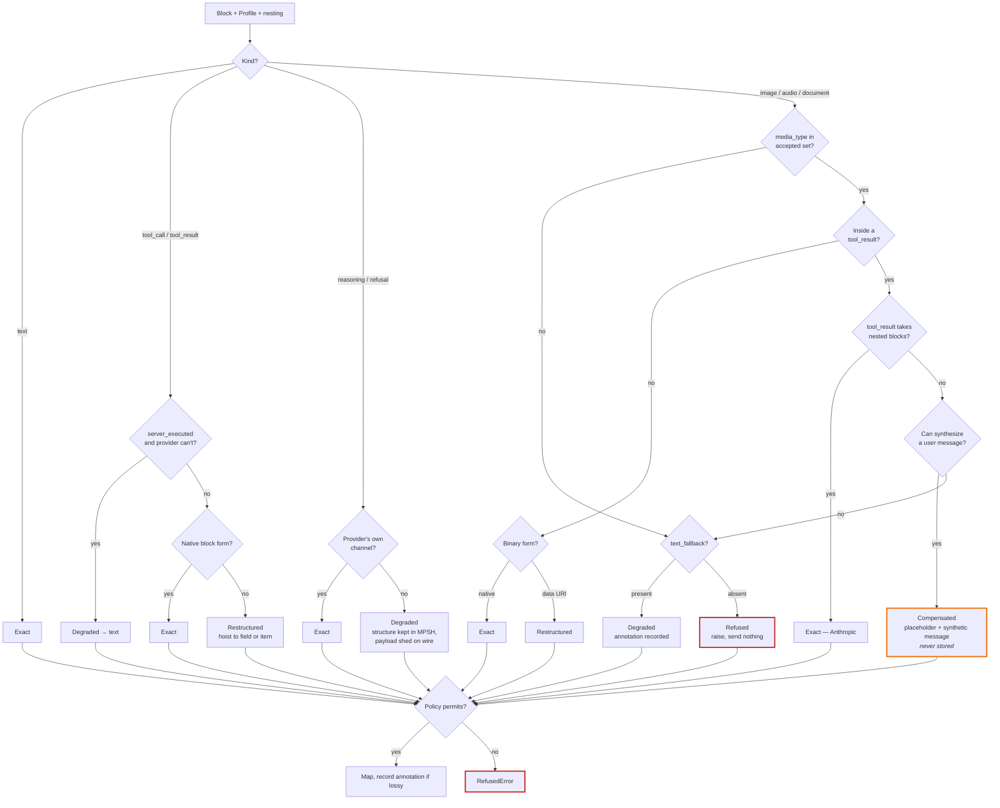

# Development of Elelem

For contributors, human and AI. It covers **how the shard is built and how to
extend it** — the layering, the conventions, the invariants a change must not
break, and the procedure for adding a protocol.

It deliberately does **not** restate design rationale. That lives in the design
documents under `docs/`, which are the specification; where this document and
`docs/MPSH_SPECIFICATION.md` disagree, the specification wins.

## Where things are written down

Five kinds of content, separated by how often they change. The separation is the
point: interleaving them is how a development document becomes unreadable, since
nobody can tell which paragraphs are still true.

Document                                   |Changes                     |Holds                                                   
-------------------------------------------|----------------------------|--------------------------------------------------------
`docs/MPSH_SPECIFICATION.md` and companions|Rarely; a change is an event|Why MPSH is shaped this way                             
`DEVELOPMENT.md` (this file)               |Slowly                      |Layering, conventions, invariants, how to add a protocol
`docs/protocols/<name>.md`                 |Per mapper                  |One protocol's declaration, gotchas, compensations      
`HANDOFF.md`                               |When a phase completes      |Where the work stands, what is next, how to work here   
`SCOPE.md`                                 |Fast; shrinks               |What is outstanding                                     

`HANDOFF.md` and `SCOPE.md` are the pair most likely to drift into each other.
The division: HANDOFF *names* the next pieces and points at SCOPE for their
detail. If an edit to HANDOFF starts restating SCOPE's entries, it is drifting —
and a stale orientation document is worse than none, which is why its state
section is kept short and factual enough to check against reality in seconds.

**The test for this file**: if a paragraph would need editing when a fifth
protocol arrives, it belongs in a protocol document instead.

## Getting started

Command         |Description                                                
----------------|-----------------------------------------------------------
`ops up`        |Sets everything up, including `crystal` via `apt` or `brew`
`ops lint`      |Run `ameba`                                                
`ops test_specs`|Run the specs                                              
`ops test`      |Specs and linter                                           

Requires [`ops`](https://github.com/nickthecook/crops), via `gem install ops_team`
or `brew tap nickthecook/crops && brew install ops`.

**Tests never touch the network.** Conformance is structural: no API key, no
running model, no HTTP object constructed. Live protocol acceptance is a
separate, later layer using recorded transcripts.

## What this shard is for

One sentence, because every decision below serves it: **a session started with
one provider can be exported and resumed with a different one.**

Portability is not a feature among features. Any change that trades it for
convenience is the wrong change, however much nicer the resulting API looks.

## Layering



```
src/elelem/
  mpsh/         canonical types — knows nothing of HTTP or any provider
  capability/   outcomes, profiles, policy — depends on mpsh, never the reverse
  protocol/     one directory per protocol:
                  capabilities.cr   declared Profile
                  wire/request.cr   serialize-only — what we build
                  wire/response.cr  parse-only — what we read
                  mapper.cr         MPSH → request
                  export.cr         request or response → MPSH
  server.cr     one deployment: host, credential, connection, status errors
  provider.cr   a server speaking one protocol, plus its vendor claim
  adapter.cr    per protocol: path, headers, prepare/read
  client.cr     send(session, model) → (Message, Report)
  options.cr    tools, output cap, reasoning — per call, never stored
  reasoning.cr  the caller's reasoning request: a rung, a budget, or off
```

Flat files rather than a directory, because a directory here *is* a namespace
and none of these five wants one yet. Group them when there are enough to share
a vocabulary, not merely a layer.

Two structural rules, both absolute:

1. **Nothing under `mpsh/` may know that HTTP or any provider exists.**
2. **Storage form is never wire form.** No canonical type serializes into a
   request body. They carry no serialization identity at all — no
   `JSON::Serializable` under `mpsh/` — so nobody can hand one to an HTTP client
   by accident. Persistence is an explicit codec beside the types.

Rule 2 is the failure that makes a client un-portable, and it has been made
before: once storage form is wire form, there is no mapping layer, and therefore
nothing to make portable.

Note the asymmetry it produces in `wire/`. A request is something this shard
*builds*, so `request.cr` is serialize-only; a response is something it *reads*,
so `response.cr` is parse-only. One direction per file, because the two fail in
different ways and mixing them invites a request type to grow a reader nobody
needs.

## Three identities, kept apart

The distinction that the live layer exists to preserve, and the one most likely
to be collapsed by a well-meaning simplification:

Axis    |Question                                    |Where it lives             
--------|--------------------------------------------|---------------------------
Protocol|Which wire shape?                           |`Capability::Profile`      
Server  |Which deployment?                           |`Server`                   
Vendor  |Whose opaque data does this endpoint honour?|`Provider` → `metadata_key`
Model   |Which capabilities within a protocol?       |`Capability::Catalog`      

Ollama forces them apart: one server, three protocols, none of them its own
vendor. A gateway forces them apart the other way — OpenRouter fronting Claude
is `server: openrouter, vendor: anthropic`, and the opaque data really does
replay.

The fourth identity is now open one axis wide. Two protocols spell reasoning
control in two units and reject being handed both, and which unit a deployment
wants is a fact about the model — so `Capability::Catalog` resolves it per call,
by narrowing the same `Profile` rather than by adding a decision path. Any
further axis should look like that or it is probably wrong.

`Provider` narrows a `Profile` when server and vendor disagree, by reassigning
`metadata_key` so `Resolver#own?` stops recognising foreign opaque data.
**Narrowing only.** A misconfigured provider can degrade, never fabricate a
capability the wire lacks. The default is pessimistic and falls out of comparing
names rather than needing a flag, because the two errors are not symmetric:
wrongly optimistic replays a signature a real endpoint rejects and breaks the
turn, while wrongly pessimistic costs fidelity that is recorded and
recoverable.

**The reasoning unit is the one deliberate exception**, and the exception is
argued rather than assumed: its budget-only models are a closed, shrinking set,
so an unknown model is far likelier to be new than ancient and the optimistic
default is right by construction. Where that argument does not hold — every
other axis so far — the pessimistic default stands.

## Conventions

**Layering is expressed with modules and `abstract def`.** Crystal has no
interfaces; a module declaring abstract methods is the closest construct that
both shares implementation and is checked at include time. Applied consistently:
`ProviderScoped`, `BlockRole`, `BinaryBlock`. Do not introduce a parallel
mechanism.

**The block catalog is a closed union, not a class hierarchy.** `MPSH::Block` is
`alias`ed over the eight block classes, which gives mappers
`case block; in TextBlock` with compiler-enforced exhaustiveness. This is the
only guard against a mapper silently forgetting a block kind, and it is why no
block has a common superclass. Adding a block kind therefore breaks every mapper
until each says what it does — as intended.

**`tool_result.content` is a nested block list, not a flat string.** Prior art
in Python uses a flat `output : String` plus an `attachments` sidecar —
simpler, but cannot express interleaved content and needs assembly when
mapping to Anthropic, whose own `tool_result` takes nested blocks natively.
Revisit only on evidence the recursive type is awkward in Crystal, with
specifics; quietly flattening it is the failure mode to avoid, since it makes
image-returning tools unrepresentable even for providers that support them
natively.

**Provider-specific data is namespaced, never special-cased.** Anything a
provider needs echoed back but nobody else can read goes under
`provider_metadata["<provider>"]`. A mapper reads only its own key, so
cross-provider drop happens with no drop logic to write or forget. Never add a
canonical field for one provider's bookkeeping.

**Identifiers are minted by MPSH.** Provider IDs live in `CallIdTable`, never in
canonical content. One provider pairs tool calls to results by name and ordering
with no ID at all, so a stored ID from elsewhere cannot supply what its mapper
needs.

**Store the strict form; synthesize the fused one at map time.** Raw base64 plus
a separate media type, never a `data:` URI. Structured tool-call arguments,
never a JSON string. The rule generalises: serialising is concatenation, parsing
is the direction that fails.

## The capability model

The single idea worth internalising: **mapping between protocols is capability
adaptation, not format conversion.** Protocols differ in what they can express,
not merely in how they arrange it.

Every block resolves to exactly one of five outcomes. Read them as *who gets
woken up*, not as descriptions:

Outcome       |Means                                     |Silent?                                
--------------|------------------------------------------|---------------------------------------
`Exact`       |Native support                            |Yes                                    
`Restructured`|Same information, different shape         |Yes                                    
`Compensated` |Meaning preserved by synthesizing messages|**Synthesized content is never stored**
`Degraded`    |Information lost, substitute used         |Annotated                              
`Refused`     |Cannot map                                |Raises; nothing sent                   

`Outcome` is ordered by fidelity, so a degradation policy is a comparison rather
than a table. The full resolution path:



**The matrix is derived, not written.** Each protocol declares a `Profile`; the
shared `Resolver` turns declaration plus block plus nesting into an outcome. Four
hand-written tables would be four places to forget the same rule, and the matrix
a caller queries would drift from the branch a mapper takes. When a protocol
behaves unexpectedly, fix its `Profile` — not the resolver, unless the rule
itself is wrong for everyone.

There is deliberately no separate `UNSUPPORTED.md`: the matrix above *is* that
document, in a better form. Queryable at runtime, expressed per media type
rather than per feature, and incapable of drifting from what a mapper actually
does, which a hand-maintained prose version would not survive one phase.

**Capability is declared per media type, not per block kind.** "Supports images"
is too coarse for a model that takes PNG but not WEBP.

Annotations are a category borrowed from `docs/PSR_BRANCHING_AND_SCATTER_GATHER.md`, which is otherwise deferred: persisted, never on the linearization path, never sent to a provider. Degradation events are the first entries; branch rankings will share the channel later.

**Annotations record loss the caller did not ask for.** Requested trimming — for
instance `ReasoningRetention` — is counted, not annotated. Mixing the two makes
the channel worthless, since a reader can no longer tell damage from choice.

The same principle is why a **Restructured** request option is never
annotated. `Report` files an annotation only for Degraded, Refused and
Compensated, so a caller whose reasoning rung became a token budget learns it
from `report.worst` moving off `Exact` and nowhere else — annotating
Restructured would make the channel mean "something was translated" rather
than "something was lost." `Resolver` returns Restructured from five places
and the mappers record it at two dozen sites; a long session would annotate
roughly in proportion to its length, and the `reasoning_dropped` counter
exists precisely to keep that noise out. The pre-request answer is better
placed anyway: `provider.profile(model)` reports the unit *before* the call.

**Refusal is a real outcome.** The alternative to explicit outcomes is not
refusal; it is silence, and silence is a model answering confidently about
content it never received. This is not hypothetical: a widely used Python
multi-provider client stores tool-result images faithfully and then discards them
in both of its OpenAI mappers, with no error and no record, because its
capability model had only one outcome and the case had nowhere to go.

## How an agent uses this shard

Two models were considered, and the difference is not stylistic.

**Model A** — the provider owns the session, MPSH is an export format used at
save points. **Model B** — MPSH *is* the working state, and a request is built
from it every turn.

**Model B is the design.** Every protocol here is stateless, so the full history
crosses the wire each turn either way; a provider-held copy buys nothing and is
a second copy in a lossier format. Under Model A a session is portable
*sometimes*, at save points. Under Model B it is portable at every turn, because
the canonical form is never stale. `Mapper#map` already takes a whole session
and returns a request, which is Model B's per-turn operation.

Statefulness, where a protocol offers it, does not change this: a server-side
handle is a disposable optimization over an authoritative local record, and the
moment a session moves to another vendor the handle is worthless.

### The turn loop belongs to the caller

`send` performs **one request**: one exchange, one reply. It does not loop, does
not dispatch tools, and does not decide whether a turn is finished. That keeps
the client a translator.

```crystal
loop do
  reply, report = client.send(session) { |event, turn| present(event) }
  session << reply

  calls = reply.content.select(MPSH::ToolCallBlock).reject(&.server_executed?)
  break if calls.empty?

  results = calls.map { |call| dispatch(call) }
  session << MPSH::Message.new(MPSH::Role::User, results)
end
```

Four details there are load-bearing:

- **Tool calls are read off the reply, not accumulated from events.** The reply
  is the authoritative record; the event stream is not. This also removes any
  need for the caller to know that "the block returned" means "all calls have
  arrived".
- **`reject(&.server_executed?)`** — a provider-run call arrives already
  complete. Dispatching one means running a tool you do not have. This is the
  one line where an error is a correctness bug rather than a fidelity one.
- **All results go in one message.** Parallel calls answering one assistant turn
  *are* one turn, which is why the mappers defer carriers and the exporters
  collapse adjacent results. Separate messages would round-trip as one anyway.
- **No finish reason is consulted.** "Are there client-executed tool calls in
  the reply" is the whole condition.

### Events are presentation; the session is state

Do not conflate them. Text arriving in three chunks is three events and one
`TextBlock`. Reasoning may be several events and one block, or a block with no
events at all. The stream describes what happened over time; the session records
what the turn contained.

The event type is a **closed union**, like `Block`, so `case ... in` is
compiler-checked and a new event kind breaks every consumer until each says what
it does. Never a stringly-typed tuple — that trap has been hit before, and it
makes every consumer re-parse.

Two consequences worth stating:

- **A terminal event carries no meaning.** Whether the model stopped or wants a
  tool is a fact about the reply, not the stream. Encoding it in an event tempts
  callers to branch on the thing that is not authoritative.
- **Degradation is an event.** Annotations reach the caller live rather than
  only post-hoc in the `Report`, which suits the loudness this design insists
  on.

Provider-specific values with no canonical equivalent travel as a namespaced
event variant carrying vendor plus `MPSH::Object` — the same namespacing as
`provider_metadata`, and unlike its predecessor it has an inverse.

### API shape

- `send` returns `(MPSH::Message, Capability::Report)`. The session stays the
  caller's; the client never owns it, because a client-owned session is Model A
  by another route.
- Degradation policy is set on the client, with an optional per-call override.
- The event block is optional. Without it the same pair is returned, minus
  progress.

## Adding a protocol

Expect the second protocol in a *family* to teach you nothing. Two OpenAI-shaped
protocols differ in surface — `messages` vs. `input`, `choices[]` vs. `output[]`
— while sharing every underlying assumption. The first real test of the
abstraction is the first protocol from a different family.

1. **Declare a `Capability::Profile`.** Accepted media types per kind, binary
   form, tool call and result forms, structural rules. Verify against current
   provider documentation, not memory — capabilities drift faster than protocol
   shapes.

   A `Profile` describes a **protocol**, never an endpoint: Ollama, LM Studio
   and vLLM all speak Chat Completions and share one profile. Its
   `metadata_key` names the **vendor** whose opaque data can be replayed, which
   is a different identity again — both OpenAI protocols declare `openai`,
   because an encrypted reasoning item issued over one is readable over the
   other.

   Two things are *not* declarable here. Whether a server-executed tool or a
   reasoning item belongs to the target is a property of the block, derived from
   its `provider_metadata` by `Resolver#own?`. A profile only says whether the
   protocol has the concept at all — necessary, not sufficient.
2. **Write the map direction.** MPSH view in, request body out. Every outcome
   goes through `Report#record`; that is where policy is enforced, and where a
   mapper that wants to lose something has to say so.
3. **Write the response reader.** `wire/response.cr`, parse-only, tolerant of
   unknown fields — providers add them constantly and a strict reader breaks on
   every vendor tweak. Only an absent top-level envelope raises. Note which
   arrays are *alternatives* (`choices`, `candidates` — take index 0, we never
   ask for more than one) and which are the reply's own parts (`output`,
   Anthropic's `content` — walk them entire).
4. **Write the export direction.** Response in, MPSH out. This direction carries
   obligations the other does not: normalize roles, mint MPSH IDs and record the
   translation, split fused representations, un-hoist fields into blocks,
   namespace provider data, flag server-executed tools, preserve redacted
   reasoning as a block rather than an omission — and **discard compensation
   scaffolding**, so a synthetic message this client generated is never
   re-imported as though it were real.
5. **Write the request options.** Tool declarations and the output cap, in this
   protocol's spelling. All four differ; see `options.cr` and
   `spec/conformance/options_spec.cr`.

   Then reasoning control, which is the awkward one, because protocols disagree
   about the *unit* and not merely the spelling. Declare `reasoning_unit` — and
   declare `Either` honestly if the protocol spells both, rather than picking
   the one today's models happen to want. `Capability::ReasoningControl` decides
   the rendering and the outcome; the mapper only spells it, and any numbers it
   needs are that protocol's own constants, because vendor figures drift exactly
   as capabilities do. See `spec/conformance/reasoning_controls_spec.cr`.

   **Absent must emit nothing.** A request that asks for no reasoning control
   must be byte-identical to one built before the option existed, or every
   committed transcript is re-cut.
6. **Write an `Adapter`.** Path, headers, error-body decoding. This is the only
   place an endpoint is named, which is what keeps `Client` protocol-agnostic.
7. **Run the shared conformance suite.** Same fixtures, every protocol.
8. **Record against a real server.** See *Live specs* below.
9. **Write `docs/protocols/<name>.md`.**

### The conformance gate

An MPSH conversation mapped to a protocol and exported back must reproduce the
original exactly — *except* where the capability matrix declares the mapping
Compensated or Degraded, in which case **the divergence must match what the
matrix predicts.**

A failure is one of three things, and naming which is mandatory:

Failure                  |Meaning                                 |Cost                                        
-------------------------|----------------------------------------|--------------------------------------------
Mapping bug              |Implementation error                    |Cheap                                       
Undeclared capability gap|The matrix is wrong                     |Cheap                                       
Genuine MPSH gap         |The format cannot express something real|**Expensive** — touches every implementation

The pair that actually validates the design is one fixture against two
protocols: an image-bearing `tool_result` mapped to a protocol that must fake the
capability, and to one that has it natively. Neither alone proves anything.

## Live specs

`spec/live/` means *needs a transcript*; everything else is `spec/conformance/`
and runs anywhere. The line is what a spec consumes, not what it is about —
`layer_spec.cr` tests the live layer and needs no network, so it is conformance.

Recording uses `wiretap`, a development-only dependency: the first run hits a
real server and writes `spec/transcripts/<name>.json`, every run after replays
from disk. Transcripts are committed. They are the evidence, and they are what
makes the suite offline for everyone who did not record them.

**Green is not the same as replayed.** Under `:once` a missing transcript is
recorded rather than failed, so a suite can pass while asserting against a
recording made seconds earlier by the code under test. Three tool specs did this
for as long as anyone looked at them. Two guards, both in `spec_helper.cr`:
`record_mode` is `:none` when `CI` is set, and `Spec.after_suite` calls
`Wiretap.verify!`, which raises if anything was recorded.

So a run that is *meant* to record needs `RECORD=1`:

```
rm spec/transcripts/ollama_tools_handoff.json
RECORD=1 crystal spec spec/live/ollama_spec.cr   # cuts it
crystal spec                                     # proves it replays
```

The second command is the one that matters. It is the first time the new
transcript is exercised as a recording rather than produced as one.

Five things learned the hard way:

- **Record, never hand-write.** Both times a transcript was guessed at rather
  than captured, the guess was wrong and cost a debugging round.
- **A fixture written by the same hand as the code tests the hand, not the
  wire.** Ollama spells the Chat Completions reasoning field `reasoning`; vLLM
  and DeepSeek spell it `reasoning_content`. The reader took only the second, so
  every Ollama reasoning trace was dropped — silently, with hundreds of offline
  examples green, because the fixtures shared the reader's assumption.
- **Share a transcript name when the request is byte-identical**, never merely
  to save a recording. Two examples that send different things get different
  names.
- **Multi-turn transcripts re-cut all their turns.** Turn *n+1* depends on what
  the model said at turn *n*, and a model is not a pure function — so a
  re-record changes every turn after the first even when nothing in the code
  moved.
- **Anything minted at run time breaks matching.** Wiretap matches on a digest
  of the request body, and MPSH call identifiers embed a timestamp, so any
  transcript replaying one could never match. `spec_helper.cr` normalises them
  for matching only; from wiretap 0.4.0 the transcript still stores what went
  over the wire. Anything else non-deterministic in a request body needs the
  same treatment, and the symptom is a miss reported as *matched method and URL,
  body differed*.

Always cap output on a live request. An uncapped local model cost this suite a
twelve-minute stall and a turn that spent 4,096 tokens reasoning without
reaching an answer.

## Contributing

Contributions are by invitation at this time — see the README. If you are
reading this as an AI contributor: `SCOPE.md` is the worklist, the documents
under `docs/` are the specification, and an item recorded in `SCOPE.md` under
"Explicitly not doing" is a decision, not an oversight to helpfully correct.
