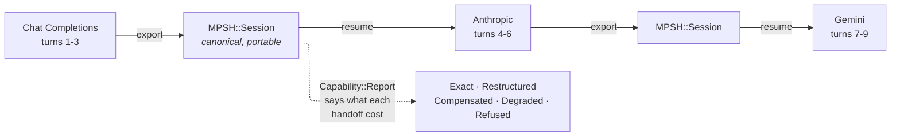

# elelem.cr

A zero-dependency Crystal shard for talking to LLMs, whose defining feature is
a **portable session history**: start a conversation with one provider, resume
it with another.

> **WARNING**: This shard is a work in progress and in development until this warning is removed.

> See [DISCLOSURE](./DISCLOSURE.md) for information how AI is used by this project.

## The point

Every vendor stores a conversation in its own shape. Anthropic keeps signed
`thinking` blocks, OpenAI's Responses API keeps encrypted reasoning items,
Gemini pairs tool calls by position rather than by id. Move a conversation
between them and something is always lost — usually quietly.

`elelem` keeps the conversation in its own canonical form (MPSH) and translates
at the edges. Translation is the interesting part, because it is not always
lossless: the shard's job is to be **honest about what it costs**, not to
pretend a handoff is free.



## Quick start

```crystal
require "elelem"

alias M = Elelem::MPSH

ollama = Elelem::Server.new("ollama", "http://localhost:11434")
provider = Elelem::Provider.for(ollama, Elelem::ProtocolKind::ChatCompletions)

session = M::Session.new
session << M::Message.user("Name three things Vienna is known for.")

reply, report = Elelem::Client.new(provider).send(session, "llama3.2")
session << reply

puts reply.text
```

`send` returns the reply **and** a report. Both matter: a caller that ignores
the report is a caller that will not notice a silent degradation, which is the
failure this whole design is arranged against.

### The handoff

A session is just data, so persisting it is a `String` in and a `String` out.

```crystal
File.write("vienna.json", M::Archive.write(session))
```

Later, somewhere else, against a different vendor and a different protocol:

```crystal
session = M::Archive.read(File.read("vienna.json"))
session << M::Message.user("Now recommend a coffee house.")

anthropic = Elelem::Server.new("anthropic", "https://api.anthropic.com",
  ENV["ANTHROPIC_API_KEY"])
provider = Elelem::Provider.for(anthropic, Elelem::ProtocolKind::Anthropic)

reply, report = Elelem::Client.new(provider).send(session, "claude-haiku-4-5")

report.annotations.each { |note| puts note }   # what the handoff cost, if anything
```

Nothing in `vienna.json` names a vendor as its owner. That is the whole idea.

### Choosing how much loss you will accept

Translation loss is graded, and the policy decides what to do about it:

Policy        |Worst outcome it will accept                                            
--------------|------------------------------------------------------------------------
`Strict`      |`Restructured` — same information, different shape                      
`Compensating`|`Compensated` — meaning preserved by synthesizing messages; the default 
`Lenient`     |`Degraded` — information lost, substitute used, each occurrence recorded

`Refused` is never accepted by any policy: it means the mapping cannot be done
at all, so nothing is sent.

```crystal
Elelem::Client.new(provider, Elelem::Capability::Policy::Strict)
```

## Supported protocols

Protocol        |Notes                                               
----------------|----------------------------------------------------
Anthropic       |Signed `thinking` blocks replayed intact            
Chat Completions|Also covers Ollama's compatible endpoint            
Responses       |OpenAI's newer API, encrypted reasoning items       
Gemini          |Positional tool pairing, `thoughtSignature` on calls

Azure OpenAI is supported as a *deployment* of the Chat Completions and
Responses protocols, not as a protocol of its own.

## The `elelem` command

The shard ships a CLI, which is also the most direct demonstration of the
handoff — start a session on one deployment, continue it on another.

```
elelem start <deployment> <prompt...> [--id <session-id>]
elelem continue <session-id> <prompt...> [--on <deployment>]
elelem list
elelem show <session-id> [--snapshots] [--json]
elelem prune <session-id> --keep <n>
elelem delete <session-id>
```

```console
$ elelem start ollama "Name three things Vienna is known for."
Session: brisk-comet
Vienna is known for its coffee houses, its classical music, and the Ringstrasse.

$ elelem continue brisk-comet "Recommend one coffee house." --on anthropic
Café Sperl, for the billiard tables and the lack of hurry.
```

Deployments are named in `elelem.yaml`; see
[docs/CLI_DESIGN.md](./docs/CLI_DESIGN.md) for the format and for why it is
shaped the way it is.

## Installation

```yaml
dependencies:
  elelem:
    github: nogginly/elelem.cr
```

No runtime dependencies, and none planned. The only development dependencies
are `ameba` and `wiretap`, the latter recording live HTTP once so the suite can
replay it offline forever.

## Documentation

Document                                                  |Holds                                                           
----------------------------------------------------------|----------------------------------------------------------------
[docs/MPSH_SPECIFICATION.md](./docs/MPSH_SPECIFICATION.md)|Why the canonical session is shaped this way                    
[DEVELOPMENT.md](./DEVELOPMENT.md)                        |Layering, conventions, how to add a protocol                    
[docs/protocols/](./docs/protocols/)                      |One file per protocol: gotchas and compensations                
[docs/servers/](./docs/servers/)                          |One file per server, and what a green run there does *not* prove
[docs/CLI_DESIGN.md](./docs/CLI_DESIGN.md)                |The `elelem` executable                                         
[SCOPE.md](./SCOPE.md)                                    |What is still outstanding                                       

## Contributions, by invitation!

*With apologies*, at this time contributions to this project are *by invitation only* and limited to people I know and see often.

- These are early days for the project and I am busy with family and work.
- At this time I want to work on this at a manageable pace.

## License

MPL-2.0. See [LICENSE](./LICENSE).
