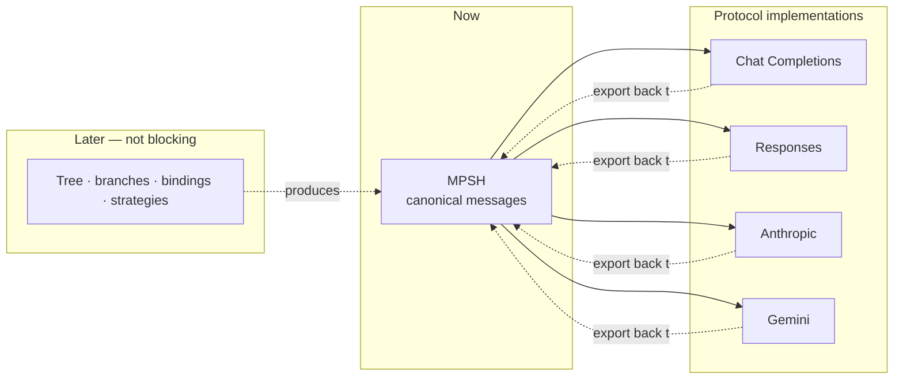
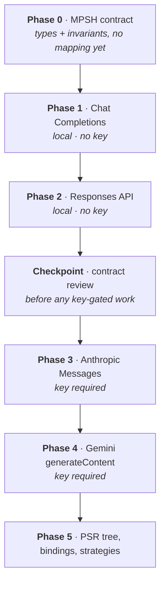
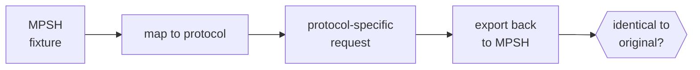

# Implementation Plan
## Minimal Portable Session History → Protocol Implementations

**Scope**: Getting to four working protocol implementations against a shared canonical message contract. Stops short of the session tree, bindings, and scatter/gather — those come after.

**Companion documents**: `LLM_PROTOCOL_COMPARISON.md` (mapping rules), the stateful-session design (PSR + bindings, not yet in this repository), `PSR_BRANCHING_AND_SCATTER_GATHER.md` (tree + strategies).

---

## 1. What's Actually Being Built First

The protocol implementations never touch the session tree. They consume a **view** — a flat message list — and produce one back. That seam is the whole interface, which means the only thing that must exist before protocol work starts is the **Minimal Portable Session History (MPSH)**: the canonical message contract.



Everything in the "later" box can change freely without disturbing the implementations, provided MPSH holds. That's the bet worth protecting.

---

## 2. MPSH

Defined authoritatively in **`MPSH_SPECIFICATION.md`**. Summarized here only for sequencing purposes:

```
MPSH
├── system_prompt : text?
└── messages[]
    ├── role : user | assistant
    ├── content[] : ContentBlock
    └── provenance?
```

with a content block catalog covering `text`, `image`, `audio`, `document`, `tool_call`, `tool_result`, `refusal`, and provider-scoped `reasoning` — plus a capability matrix and degradation ladder governing how each maps to each protocol.

---

## 3. The Highest-Risk Decisions

Every implementation keys off the block catalog, so a change after two implementations exist means reworking two, and after four, all four. These must be settled in Phase 0:

Decision                                                      |Why it bites later                                                                                                                                                                                                                                                              
--------------------------------------------------------------|--------------------------------------------------------------------------------------------------------------------------------------------------------------------------------------------------------------------------------------------------------------------------------
**Tool calls and results are blocks, not roles or fields**    |Two of four protocols model them as blocks natively. Modelling a tool result as a `role: "tool"` message only looks right if Chat Completions is the only protocol in view, and unwinding it later means rewriting every mapper's tool path                                     
**`tool_result.content` is a nested block list, not a string**|A string-typed result makes image-returning tools permanently unrepresentable, *including for providers that support them natively*                                                                                                                                             
**MPSH mints its own `call_id`**                              |Gemini pairs calls to responses by name and ordering with no ID at all. A stored OpenAI ID cannot supply what a Gemini mapper needs. Retrofitting is unusually painful because existing sessions won't carry the IDs                                                            
**Raw base64 + separate media type; never a `data:` URI**     |Two providers want the parts separated. Synthesizing a URI is concatenation; parsing one back out is error-prone                                                                                                                                                                
**Binary payloads support a reference form**                  |Inline base64 in stored history means every replay carries the payload forever — the exact problem stateful sessions were adopted to solve. Audio makes it materially worse than images                                                                                         
**`text_fallback` on every binary block**                     |The sole mechanism separating *degrade* from *refuse* when content hits a provider that can't accept it                                                                                                                                                                         
**Compensation is generated at map time and never stored**    |Chat Completions cannot express an image-bearing tool result, so a mapper must synthesize a placeholder plus an extra user message. Writing that scaffolding into history makes an OpenAI workaround permanent and portable — it then travels to Claude, which needed none of it
**Refusal is a real outcome**                                 |Silently dropping an audio block yields a model answering confidently about content it never received                                                                                                                                                                           

---

## 4. Build Order

Your access constraints set the sequence — local models first, keyed APIs after. That's the right practical order, with one caveat worth planning around (§5).



Phase |Deliverable                                                      |Gate to pass                                                                                          |What it proves                                                                       
------|-----------------------------------------------------------------|------------------------------------------------------------------------------------------------------|-------------------------------------------------------------------------------------
**0** |MPSH types, invariants, block catalog, capability-matrix skeleton|Structural round-trip of hand-built fixtures through no provider at all                               |The contract is self-consistent                                                      
**1** |Chat Completions map + export + declared capabilities            |Round-trip fidelity; **compensation path for image-bearing tool results** exercised                   |Basic mapping works, *and* the compensation machinery is real rather than theoretical
**2** |Responses API map + export + declared capabilities               |Round-trip fidelity; `output[]` item-type extraction; item-based tool calls                           |Contract survives a differently shaped request/response in the same family           
**CP**|Contract review                                                  |No open questions from §3; Anthropic and Gemini mappings written and structurally verified            |Cheapest possible moment to change MPSH                                              
**3** |Anthropic map + export + declared capabilities                   |Round-trip fidelity; alternation, first-user, `max_tokens`; **native image-in-tool-result exact path**|Contract survives both the strictest validator *and* the most capable target         
**4** |Gemini map + export + declared capabilities                      |Round-trip fidelity; role rename, `parts` wrapping, **ID-less tool pairing reconstruction**           |Contract survives the most structurally divergent protocol                           
**5** |Tree, bindings, scatter/gather                                   |—                                                                                                     |Sessions become branchable and portable                                              

Phase 1 is deliberately loaded. Chat Completions is the protocol that *cannot* express an image-bearing tool result, so it exercises compensation on day one — before the machinery has ossified around protocols that never needed it. Phase 3 then exercises the opposite extreme on the same fixture, which is the pair that actually validates the capability model.

---

## 5. The Sequencing Caveat

Phases 1 and 2 are both OpenAI-shaped. They differ in surface (`messages` vs `input`, `choices[]` vs `output[]`) but share their underlying assumptions: flexible roles, no alternation rule, string shorthand permitted, model in the body.

**Passing both proves less than it appears to.** The first genuine test of the abstraction is the second protocol *family*, not the second implementation — and that's Phase 3 or 4, gated behind API keys you don't have yet.

Two things reduce the risk without needing keys:

Mitigation                                                                                                                                                          |Effort                               
--------------------------------------------------------------------------------------------------------------------------------------------------------------------|-------------------------------------
Write the Anthropic and Gemini *mapping rules* on paper during Phase 0, as validation constraints on MPSH — the rules are already documented in the comparison guide|Low; mostly already done             
Build a **local conformance harness** (§6) that checks mapping output structurally, without calling any API                                                         |Moderate; pays for itself immediately

The second one matters most: you can write and structurally verify the Anthropic and Gemini mappings *before* obtaining keys. The key only gates confirming that a live model accepts the request — not whether your mapping produces the right shape. Building those two mappings early, even unexecuted, is what actually de-risks the contract.

---

## 6. The Conformance Gate

One test shape, applied identically to every implementation, and the thing that proves the abstraction holds:



**Round-trip fidelity**: an MPSH conversation mapped into a protocol form and exported back must reproduce the original exactly — *except* where that implementation's capability matrix declares the mapping Compensated or Degraded, in which case the divergence must match what the matrix predicts.

A failure is one of three things, and naming which is mandatory:

Failure                  |Meaning                                |Cost                                                         
-------------------------|---------------------------------------|-------------------------------------------------------------
Mapping bug              |Implementation error                   |Cheap                                                        
Undeclared capability gap|The matrix is wrong                    |Cheap                                                        
Genuine MPSH gap         |The format can't express something real|**Expensive** — a format change touching every implementation

Full fixture set in `MPSH_SPECIFICATION.md` §9. The additions that matter most for sequencing:

Fixture                                   |Targets                                             |Available from
------------------------------------------|----------------------------------------------------|--------------
Tool call → text result                   |Field-vs-block hoisting, ID translation             |Phase 0       
**Tool call → result containing an image**|Compensation; synthetic messages must not round-trip|Phase 0       
Audio with transcript / without           |Degrade vs. refuse                                  |Phase 0       
Reasoning block present                   |Provider-scoped retention and cross-provider drop   |Phase 0       
Reference payload                         |Materialization at map time                         |Phase 0       

All structural — no API call, no key, no local model. They run from Phase 0 onward and are why the Anthropic and Gemini mappings can be written and verified before their keys arrive.

---

## 7. Explicitly Deferred

Kept out of scope so the early phases stay small:

Deferred                                                    |Until                                                
------------------------------------------------------------|-----------------------------------------------------
Tree, branches, node identity                               |Phase 5                                              
Provider bindings, stateful handles, drift detection        |Phase 5                                              
Scatter, gather, exchange                                   |After Phase 5                                        
Tool **execution** — dispatch, loops, native function wiring|After Phase 4                                        
Streaming                                                   |Independent axis; adds nothing to contract validation
Prompt caching and compaction                               |Optimizations on a working mapping, not prerequisites

**Corrected from v1.0**: tool/function calling blocks were previously deferred until after all four protocols worked. That was wrong. The *shape* of tool blocks is the single most divergent area across the four protocols and is exactly the retrofit this sequencing exists to prevent — deferring it guarantees rewriting four mappers. Tool block shape moves into Phase 0; only tool *execution* is deferred.

**Annotations** also move earlier, from "after Phase 5" to Phase 0 in minimal form: degradation events need somewhere to be recorded from the first mapping onward. The full annotation model (rankings, evaluations) still waits for Phase 5.

---

## 8. Checklist

**Phase 0**
- [ ] Canonical roles fixed at `user` / `assistant`; provider names never stored
- [ ] Content always stored as a list, never a bare string
- [ ] Full block catalog defined, including `tool_call` and `tool_result`
- [ ] `tool_result.content` is a nested block list
- [ ] MPSH `call_id` minting and provider-ID translation state defined
- [ ] Payload supports inline and reference forms; raw base64 + media type
- [ ] `text_fallback` on every binary block
- [ ] `provider_metadata` on every block and message, keyed by provider name
- [ ] Capability-matrix skeleton and the five mapping outcomes defined
- [ ] Minimal annotation channel for recording degradation
- [ ] Conformance fixtures written, including the compensation and degrade/refuse cases

**Phases 1–2 (local, no keys)**
- [ ] Chat Completions passes round-trip on all fixtures
- [ ] Compensation path exercised: image-bearing tool result renders, and its synthetic scaffolding does **not** round-trip back into MPSH
- [ ] Responses API passes round-trip on all fixtures
- [ ] `output[]` item-type extraction handled, not positional indexing
- [ ] Both declare their capability matrices, verified against current provider docs

**Checkpoint**
- [ ] Anthropic and Gemini mappings written and structurally verified, unexecuted
- [ ] Any MPSH change surfaced by those two mappings made *now*, not after Phase 3

**Phases 3–4 (keys required)**
- [ ] Anthropic: alternation, first-user, `max_tokens` enforced at map time
- [ ] Anthropic: image-bearing tool result takes the **exact** path, no compensation
- [ ] Gemini: role rename, `parts` wrapping, model-in-URL handled
- [ ] Gemini: tool call/result pairing reconstructed without provider IDs
- [ ] Both pass round-trip on all fixtures
- [ ] Live calls confirm the structurally-verified mappings are accepted

---

**Document Version**: 2.1

**Last Updated**: 2026-08-17

**Changes from 2.0**: Phase 0 checklist corrected — "portability class on every block" was superseded by namespaced `provider_metadata` in `MPSH_SPECIFICATION.md` v1.1 and should have been removed then.

**Changes from 1.0**: MPSH definition moved to `MPSH_SPECIFICATION.md`. Tool block shape un-deferred into Phase 0. Capability matrix and degradation outcomes added as Phase 0 deliverables. Conformance redefined as matrix-aware.
