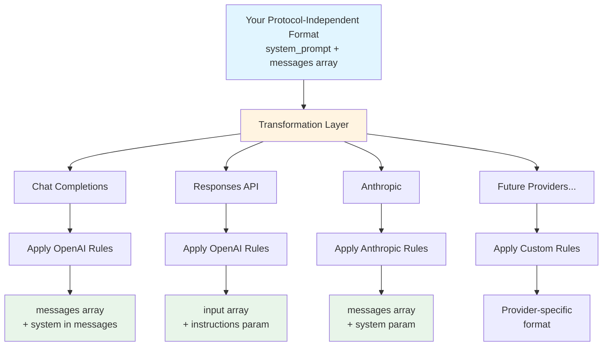
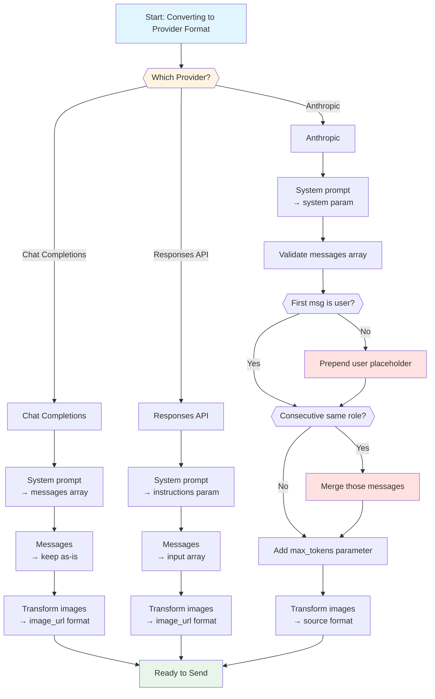
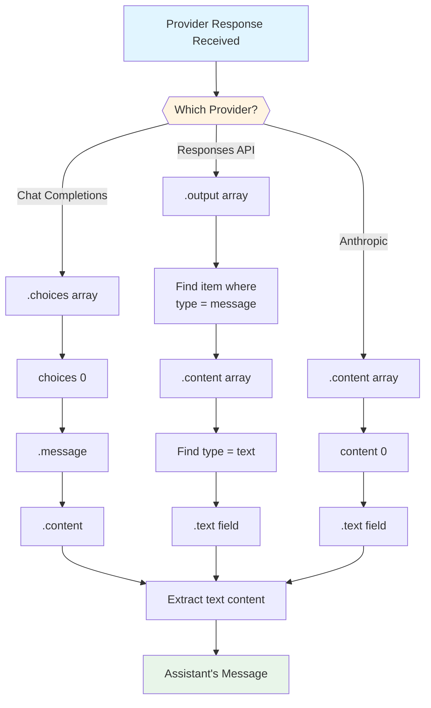
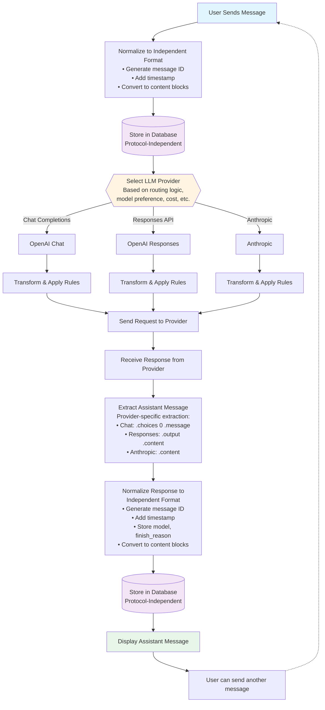

# LLM API Protocol Comparison Guide
## Stateless Multi-Provider Implementation

**Document Purpose**: Understanding and mapping between OpenAI Chat Completions, OpenAI Responses API (stateless), Anthropic Messages API, and Google Gemini's `generateContent` API.

**Focus**: Stateless implementations only - all conversation history managed client-side.

---

## Table of Contents
1. [Protocol Overview](#protocol-overview)
2. [High-Level Comparison](#high-level-comparison)
3. [Protocol Structures](#protocol-structures)
4. [Protocol-Independent Format](#protocol-independent-format)
5. [Mapping Examples](#mapping-examples)
6. [Content Blocks & Multimodal](#content-blocks--multimodal)
7. [Key Differences & Gotchas](#key-differences--gotchas)
8. [Migration Guide](#migration-guide)

---

## Protocol Overview

### OpenAI Chat Completions API
- **Endpoint**: `POST /v1/chat/completions`
- **Status**: Widely adopted, stable, will be maintained indefinitely
- **Use Case**: Traditional chat applications, simple integrations
- **State**: Fully stateless - client sends complete conversation history

### OpenAI Responses API (Stateless Mode)
- **Endpoint**: `POST /v1/responses`
- **Status**: Newer API, recommended for new projects
- **Use Case**: Agentic workflows, reasoning models, built-in tools
- **State**: Can be stateless (we'll use this mode) or stateful — as of mid-2026, stateful mode has two flavors: chaining via `previous_response_id`, or a fuller `conversation` object (Conversations API). Both are out of scope here since we're staying stateless.

### Anthropic Messages API
- **Endpoint**: `POST /v1/messages`
- **Status**: Mature, stable
- **Use Case**: High-quality reasoning, analysis, long-form content
- **State**: Always stateless

### Google Gemini `generateContent` API
- **Endpoint**: `POST /v1beta/{model}:generateContent`
- **Status**: The original, stable Gemini API. Google now also offers a newer, stateful "Interactions API" (parallel to OpenAI's Responses API situation) — this guide covers only the stateless `generateContent`.
- **Use Case**: Multimodal generation, long context, function calling
- **State**: Stateless — client sends complete conversation history

> **Note**: Every provider here now has the same two-track pattern: a mature stateless API (what this guide covers) and a newer stateful API (out of scope for now). Keep that in mind as you evaluate future upgrades.

---

## High-Level Comparison

Feature                 |Chat Completions             |Responses API                     |Anthropic Messages        |Gemini generateContent                      
------------------------|-----------------------------|----------------------------------|--------------------------|--------------------------------------------
**Request Structure**   |Array of messages            |Input + optional messages         |System + array of messages|`contents` array                            
**System Prompt**       |Part of messages array       |`instructions` parameter          |`system` parameter        |`systemInstruction` field                   
**Content Format**      |String or content blocks     |String or content blocks          |String or content blocks  |Always array of "parts"                     
**Role Names**          |system, user, assistant, tool|user, assistant                   |user, assistant           |**user, model**                             
**Must Alternate Roles**|No                           |No                                |**Yes** (strict)          |No (recommended, not enforced)              
**First Message**       |Any role                     |user                              |**Must be user**          |Any role                                    
**Response Field**      |`choices[].message`          |`output[]` (array of items)       |`content[]`               |`candidates[].content.parts[]`              
**Tool Execution**      |Manual                       |Auto or manual                    |Manual                    |Manual                                      
**Built-in Tools**      |None                         |web_search, code_interpreter, etc.|None                      |code_execution, Google Search grounding     
**Model ID in URL**     |No (body param)              |No (body param)                   |No (body param)           |**Yes** — model is part of the endpoint path

**The single biggest Gemini difference:** it calls the assistant role `"model"`, not `"assistant"`, and every piece of content — even a single line of text — lives inside a `"parts"` array on a `"contents"` object. There's no string-shorthand like the other three providers offer.

---

## Protocol Structures

### OpenAI Chat Completions

**Request:**
```json
{
  "model": "gpt-4",
  "messages": [
    {
      "role": "system",
      "content": "You are a helpful assistant"
    },
    {
      "role": "user",
      "content": "What is the capital of France?"
    },
    {
      "role": "assistant",
      "content": "The capital of France is Paris."
    },
    {
      "role": "user",
      "content": "What about Spain?"
    }
  ],
  "temperature": 0.7
}
```

**Response:**
```json
{
  "id": "chatcmpl-abc123",
  "object": "chat.completion",
  "created": 1677652288,
  "model": "gpt-4",
  "choices": [
    {
      "index": 0,
      "message": {
        "role": "assistant",
        "content": "The capital of Spain is Madrid."
      },
      "finish_reason": "stop"
    }
  ],
  "usage": {
    "prompt_tokens": 45,
    "completion_tokens": 12,
    "total_tokens": 57
  }
}
```

### OpenAI Responses API (Stateless)

**Request:**
```json
{
  "model": "gpt-4o",
  "instructions": "You are a helpful assistant",
  "input": [
    {
      "role": "user",
      "content": "What is the capital of France?"
    },
    {
      "role": "assistant",
      "content": "The capital of France is Paris."
    },
    {
      "role": "user",
      "content": "What about Spain?"
    }
  ],
  "temperature": 0.7
}
```

**Alternative (simple string input):**
```json
{
  "model": "gpt-4o",
  "instructions": "You are a helpful assistant",
  "input": "What is the capital of France?",
  "temperature": 0.7
}
```

**Response:**
```json
{
  "id": "resp-abc123",
  "object": "response",
  "created": 1677652288,
  "model": "gpt-4o",
  "output": [
    {
      "type": "message",
      "role": "assistant",
      "content": [
        {
          "type": "text",
          "text": "The capital of Spain is Madrid."
        }
      ]
    }
  ],
  "usage": {
    "input_tokens": 45,
    "output_tokens": 12,
    "total_tokens": 57
  }
}
```

### Anthropic Messages API

**Request:**
```json
{
  "model": "claude-sonnet-4-5-20250929",
  "system": "You are a helpful assistant",
  "messages": [
    {
      "role": "user",
      "content": "What is the capital of France?"
    },
    {
      "role": "assistant",
      "content": "The capital of France is Paris."
    },
    {
      "role": "user",
      "content": "What about Spain?"
    }
  ],
  "max_tokens": 1024,
  "temperature": 0.7
}
```

**Response:**
```json
{
  "id": "msg-abc123",
  "type": "message",
  "role": "assistant",
  "content": [
    {
      "type": "text",
      "text": "The capital of Spain is Madrid."
    }
  ],
  "model": "claude-sonnet-4-5-20250929",
  "stop_reason": "end_turn",
  "usage": {
    "input_tokens": 45,
    "output_tokens": 12
  }
}
```

### Google Gemini `generateContent`

**Request:**
```
POST /v1beta/models/gemini-2.5-flash:generateContent
```
```json
{
  "systemInstruction": {
    "parts": [
      {"text": "You are a helpful assistant"}
    ]
  },
  "contents": [
    {
      "role": "user",
      "parts": [{"text": "What is the capital of France?"}]
    },
    {
      "role": "model",
      "parts": [{"text": "The capital of France is Paris."}]
    },
    {
      "role": "user",
      "parts": [{"text": "What about Spain?"}]
    }
  ],
  "generationConfig": {
    "temperature": 0.7
  }
}
```

**Response:**
```json
{
  "candidates": [
    {
      "content": {
        "role": "model",
        "parts": [
          {"text": "The capital of Spain is Madrid."}
        ]
      },
      "finishReason": "STOP",
      "index": 0
    }
  ],
  "usageMetadata": {
    "promptTokenCount": 45,
    "candidatesTokenCount": 12,
    "totalTokenCount": 57
  },
  "modelVersion": "gemini-2.5-flash"
}
```

**Structural notes:**
- The model name is part of the **URL path**, not the request body (`.../models/gemini-2.5-flash:generateContent`)
- `contents` is the equivalent of `messages`/`input`, but every entry is a `{role, parts}` object — no plain-string messages
- `systemInstruction` is its own top-level field, structured the same way as any other content object (`parts` array), not a plain string
- The assistant's role is literally the string `"model"`, not `"assistant"`
- The response wraps everything in `candidates[]` (plural — Gemini can return multiple candidate responses per request)

---

## Protocol-Independent Format

### Design Goals
1. Capture all information needed for any provider
2. Provider-agnostic conversation history
3. Easy to serialize/deserialize
4. Support for metadata and extensions
5. Handle multimodal content uniformly

### Proposed Structure

```json
{
  "conversation_id": "conv_550e8400",
  "created_at": "2024-01-15T10:30:00Z",
  "updated_at": "2024-01-15T10:35:00Z",
  "metadata": {
    "title": "Geography Q&A",
    "user_id": "user_123",
    "tags": ["education", "geography"]
  },
  "system_prompt": "You are a helpful assistant specializing in geography and world capitals.",
  "messages": [
    {
      "id": "msg_001",
      "role": "user",
      "timestamp": "2024-01-15T10:30:00Z",
      "content": [
        {
          "type": "text",
          "text": "What is the capital of France?"
        }
      ]
    },
    {
      "id": "msg_002",
      "role": "assistant",
      "timestamp": "2024-01-15T10:30:05Z",
      "content": [
        {
          "type": "text",
          "text": "The capital of France is Paris."
        }
      ],
      "model": "gpt-4",
      "finish_reason": "stop"
    },
    {
      "id": "msg_003",
      "role": "user",
      "timestamp": "2024-01-15T10:35:00Z",
      "content": [
        {
          "type": "text",
          "text": "What about Spain?"
        }
      ]
    }
  ]
}
```

### Key Design Decisions

Element                     |Rationale                                          
----------------------------|---------------------------------------------------
**Separate `system_prompt`**|Not all providers treat system prompts the same way
**Content blocks array**    |Uniform handling of text and multimodal content    
**Message IDs**             |Track individual messages for editing, branching   
**Timestamps**              |Audit trail, conversation flow analysis            
**Role normalization**      |Only "user" and "assistant" (no "system", "tool")  
**Metadata**                |Provider-agnostic conversation information         

---

## Mapping Examples

### Transformation Flow Overview



### Mapping Examples

### Example 1: Simple Text Conversation

**Your Independent Format:**
```json
{
  "system_prompt": "You are a helpful assistant",
  "messages": [
    {
      "role": "user",
      "content": [{"type": "text", "text": "What is 2+2?"}]
    },
    {
      "role": "assistant",
      "content": [{"type": "text", "text": "2+2 equals 4"}]
    },
    {
      "role": "user",
      "content": [{"type": "text", "text": "Thanks!"}]
    }
  ]
}
```

**→ Chat Completions:**
```json
{
  "model": "gpt-4",
  "messages": [
    {"role": "system", "content": "You are a helpful assistant"},
    {"role": "user", "content": "What is 2+2?"},
    {"role": "assistant", "content": "2+2 equals 4"},
    {"role": "user", "content": "Thanks!"}
  ]
}
```

**→ Responses API:**
```json
{
  "model": "gpt-4o",
  "instructions": "You are a helpful assistant",
  "input": [
    {"role": "user", "content": "What is 2+2?"},
    {"role": "assistant", "content": "2+2 equals 4"},
    {"role": "user", "content": "Thanks!"}
  ]
}
```

**→ Anthropic:**
```json
{
  "model": "claude-sonnet-4-5-20250929",
  "system": "You are a helpful assistant",
  "max_tokens": 1024,
  "messages": [
    {"role": "user", "content": "What is 2+2?"},
    {"role": "assistant", "content": "2+2 equals 4"},
    {"role": "user", "content": "Thanks!"}
  ]
}
```

**→ Gemini (`POST /v1beta/models/gemini-2.5-flash:generateContent`):**
```json
{
  "systemInstruction": {
    "parts": [{"text": "You are a helpful assistant"}]
  },
  "contents": [
    {"role": "user", "parts": [{"text": "What is 2+2?"}]},
    {"role": "model", "parts": [{"text": "2+2 equals 4"}]},
    {"role": "user", "parts": [{"text": "Thanks!"}]}
  ]
}
```

Note the two role renames (`assistant` → `model`) and that every message becomes a `{role, parts}` object — there is no plain-string shorthand.

### Example 2: Multimodal with Image

**Your Independent Format:**
```json
{
  "system_prompt": "You are an image analysis assistant",
  "messages": [
    {
      "role": "user",
      "content": [
        {"type": "text", "text": "What's in this image?"},
        {
          "type": "image",
          "image_data": "base64_encoded_string...",
          "media_type": "image/jpeg"
        }
      ]
    }
  ]
}
```

**→ Chat Completions:**
```json
{
  "model": "gpt-4-vision-preview",
  "messages": [
    {"role": "system", "content": "You are an image analysis assistant"},
    {
      "role": "user",
      "content": [
        {"type": "text", "text": "What's in this image?"},
        {
          "type": "image_url",
          "image_url": {
            "url": "data:image/jpeg;base64,base64_encoded_string..."
          }
        }
      ]
    }
  ]
}
```

**→ Responses API:**
```json
{
  "model": "gpt-4o",
  "instructions": "You are an image analysis assistant",
  "input": [
    {
      "role": "user",
      "content": [
        {"type": "text", "text": "What's in this image?"},
        {
          "type": "image_url",
          "image_url": {
            "url": "data:image/jpeg;base64,base64_encoded_string..."
          }
        }
      ]
    }
  ]
}
```

**→ Gemini:**
```json
{
  "systemInstruction": {
    "parts": [{"text": "You are an image analysis assistant"}]
  },
  "contents": [
    {
      "role": "user",
      "parts": [
        {"text": "What's in this image?"},
        {
          "inline_data": {
            "mime_type": "image/jpeg",
            "data": "base64_encoded_string..."
          }
        }
      ]
    }
  ]
}
```

Gemini's image format (`inline_data` with `mime_type`/`data`) is structurally close to Anthropic's (`source` with `media_type`/`data`) — both keep raw base64 with no `data:` URI prefix, unlike the two OpenAI APIs.

**→ Anthropic:**
```json
{
  "model": "claude-sonnet-4-5-20250929",
  "system": "You are an image analysis assistant",
  "max_tokens": 1024,
  "messages": [
    {
      "role": "user",
      "content": [
        {"type": "text", "text": "What's in this image?"},
        {
          "type": "image",
          "source": {
            "type": "base64",
            "media_type": "image/jpeg",
            "data": "base64_encoded_string..."
          }
        }
      ]
    }
  ]
}
```

---

## Content Blocks & Multimodal

### Content Block Mapping Table

Your Format    |Chat Completions                                         |Responses API                                            |Anthropic                                                                            |Gemini                                                  
---------------|---------------------------------------------------------|---------------------------------------------------------|-------------------------------------------------------------------------------------|--------------------------------------------------------
**Text**       |`{"type": "text", "text": "..."}`                        |`{"type": "text", "text": "..."}`                        |`{"type": "text", "text": "..."}`                                                    |`{"text": "..."}`                                       
**Image**      |`{"type": "image_url", "image_url": {"url": "data:..."}}`|`{"type": "image_url", "image_url": {"url": "data:..."}}`|`{"type": "image", "source": {"type": "base64", "media_type": "...", "data": "..."}}`|`{"inline_data": {"mime_type": "...", "data": "..."}}`  
**Simple text**|String shorthand: `"content": "text"`                    |String shorthand: `"content": "text"`                    |String shorthand: `"content": "text"`                                                |**No shorthand** — always `{"parts": [{"text": "..."}]}`

### Your Normalized Image Format

Store images in a provider-neutral way:

```json
{
  "type": "image",
  "image_data": "base64_string_without_prefix",
  "media_type": "image/jpeg"
}
```

**Mapping logic:**
- **OpenAI (both APIs)**: Prefix with `data:{media_type};base64,` → wrap in `image_url.url`
- **Anthropic**: Keep separate → use `source.data` (no prefix), `source.media_type`

---

## Capability Asymmetry — Correction to This Document's Framing

> **Added in v1.2.** Everything above treats mapping as *rearrangement*: the same information in different shapes. That framing is incomplete. Some protocols can express things others cannot, and closing the gap requires synthesizing messages that never occurred.
>
> The canonical case: Anthropic's `tool_result` accepts an array of content blocks **including images**, so a tool returning a screenshot is natively expressible. Chat Completions requires tool results to be strings, so the same conversation can only be rendered by emitting a placeholder result plus an extra synthetic user message carrying the image.
>
> Consequences that override guidance given earlier in this document:
> - The canonical format is the **union** of provider capabilities, not the intersection
> - Mappers may synthesize messages, but **synthesized content is never stored**
> - Loss must be recorded or refused, never silent
>
> Full treatment in `MPSH_SPECIFICATION.md`. The mapping rules below remain correct for text and images; the tool-calling tables that follow are new.

---

## Tool Calling Across the Four Protocols

The most divergent area of all four protocols, and the one this document originally omitted.

### Where each protocol puts a tool call

Protocol            |Location                                                         |Shape                                                         
--------------------|-----------------------------------------------------------------|--------------------------------------------------------------
**Chat Completions**|`tool_calls` field on the assistant message, sibling to `content`|Array of `{id, type: "function", function: {name, arguments}}`
**Responses API**   |`function_call` item in the output/input array                   |Item with `call_id`, `name`, `arguments`                      
**Anthropic**       |`tool_use` **content block** inside the assistant message        |`{type: "tool_use", id, name, input}`                         
**Gemini**          |`functionCall` **part** inside a `model` content object          |`{functionCall: {name, args}}`                                

### Where each protocol puts a tool result

Protocol            |Location                                             |Shape                                                                 |Can carry an image?        
--------------------|-----------------------------------------------------|----------------------------------------------------------------------|---------------------------
**Chat Completions**|Separate message with `role: "tool"`                 |`{role: "tool", tool_call_id, content: <string>}`                     |❌ No                       
**Responses API**   |`function_call_output` item                          |`{type, call_id, output}`                                             |❌ No                       
**Anthropic**       |`tool_result` **content block inside a user message**|`{type: "tool_result", tool_use_id, content: <string or block array>}`|✅ **Yes**                  
**Gemini**          |`functionResponse` **part** in a user content object |`{functionResponse: {name, response}}`                                |Verify against current docs

### Call/result pairing identity

Protocol            |Mechanism                                                   
--------------------|------------------------------------------------------------
**Chat Completions**|`id` on the call, echoed as `tool_call_id` on the result    
**Responses API**   |`call_id` on both                                           
**Anthropic**       |`id` on `tool_use`, echoed as `tool_use_id` on `tool_result`
**Gemini**          |**No identifier** — paired by function name and ordering    

Gemini's lack of an ID is the constraint that decides the design: a canonical format storing a provider-issued ID cannot supply what a Gemini mapper needs, and a Gemini-originated session has no ID to store. The canonical format must mint its own identifier and keep provider IDs as per-binding translation state.

### The field-vs-block rule

Two of four protocols model tool calls and results as content blocks; two model them as message-level fields or distinct roles. When protocols disagree this way, **store the block form** — hoisting a block into a field is mechanical and lossless, while splitting a field into blocks requires invention.

This means a tool result is *not* a message role in the canonical format, despite Chat Completions modelling it that way.

---

## Key Differences & Gotchas

### Transformation Decision Tree



### System Prompts

Provider            |Implementation               |Notes                                                                                              
--------------------|-----------------------------|---------------------------------------------------------------------------------------------------
**Chat Completions**|Message with `role: "system"`|Can appear anywhere in array, multiple allowed                                                     
**Responses API**   |`instructions` parameter     |Separate from messages array                                                                       
**Anthropic**       |`system` parameter           |Separate from messages array, required to be consistent                                            
**Gemini**          |`systemInstruction` field    |Separate field, but structured like a content object (`{parts: [{text: ...}]}`), not a plain string

**Gotcha**: If you have multiple system messages, you'll need to merge them for Anthropic, Responses API, and Gemini. For Gemini specifically, remember the merged text still needs to be wrapped in the `parts` array structure, not passed as a bare string.

**Newer gotcha (OpenAI only)**: For reasoning models (o-series and newer), OpenAI now expects `role: "developer"` instead of `role: "system"` in both Chat Completions and the Responses API — the `developer` role carries the same authority and placement rules that `system` used to. Older, non-reasoning models still accept `system`. If your independent format needs to target both model families, you'll want to make the role name for the system prompt a configurable/model-dependent choice rather than a hardcoded `"system"`.

### Message Alternation

Provider            |Rule                  |Enforcement                                                                                
--------------------|----------------------|-------------------------------------------------------------------------------------------
**Chat Completions**|None                  |Can have user→user, assistant→assistant                                                    
**Responses API**   |None                  |Flexible                                                                                   
**Anthropic**       |**Strict alternation**|Must be user→assistant→user→assistant                                                      
**Gemini**          |None enforced         |Recommended to alternate for best results, but the API won't reject non-alternating history

**Gotcha**: Anthropic will reject requests that don't alternate. You may need to merge consecutive messages from the same role. Gemini is forgiving here — one less validation step compared to Anthropic.

**Example fix:**
```json
// Your format (consecutive user messages)
[
  {"role": "user", "content": "Hello"},
  {"role": "user", "content": "Are you there?"}
]

// For Anthropic, merge into one message:
[
  {"role": "user", "content": "Hello\n\nAre you there?"}
]
```

### First Message

Provider            |Rule                    
--------------------|------------------------
**Chat Completions**|Can start with any role 
**Responses API**   |Can start with any role 
**Anthropic**       |**Must start with user**
**Gemini**          |Can start with any role 

**Gotcha**: If your first message is from assistant, prepend a user message for Anthropic. No such requirement for Gemini.

### Required Parameters

Parameter    |Chat Completions    |Responses API         |Anthropic           |Gemini                                                       
-------------|--------------------|----------------------|--------------------|-------------------------------------------------------------
`model`      |✅ Required (body)   |✅ Required (body)     |✅ Required (body)   |✅ Required (**URL path**, not body)                          
`messages`   |✅ Required          |⚠️  Use `input` instead|✅ Required          |⚠️  Use `contents` instead                                    
`max_tokens` |Optional            |Optional              |✅ **Required**      |Optional (`maxOutputTokens` inside `generationConfig`)       
`temperature`|Optional (default 1)|Optional (default 1)  |Optional (default 1)|Optional (inside `generationConfig`, default varies by model)

**Gotcha**: Anthropic requires `max_tokens` explicitly with no default — common values are 1024-8192. Gemini is the only provider where the model name isn't a body field at all; it's baked into the URL, which changes how your request-building logic needs to branch (URL construction vs. payload construction).

### Response Extraction

**Response extraction flow by provider:**



**Extraction table:**

Provider            |Path to Content                               |Notes                                                                    
--------------------|----------------------------------------------|-------------------------------------------------------------------------
**Chat Completions**|`response.choices[0].message.content`         |Simple string or content blocks                                          
**Responses API**   |`response.output[].content[].text`            |Need to find message item first, then text block                         
**Anthropic**       |`response.content[0].text`                    |Content is always array of blocks                                        
**Gemini**          |`response.candidates[0].content.parts[0].text`|Wrapped in `candidates[]` (plural, supports multiple candidate responses)

**Response structure comparison:**

Element              |Chat Completions                        |Responses API                      |Anthropic                    |Gemini                                             
---------------------|----------------------------------------|-----------------------------------|-----------------------------|---------------------------------------------------
**Top-level wrapper**|`choices` array                         |`output` array                     |`content` array              |`candidates` array                                 
**Message location** |`choices[0].message`                    |`output[i]` where `type="message"` |Root level                   |`candidates[0].content`                            
**Role field**       |`.message.role`                         |`.role`                            |`.role` (in response object) |`.content.role` (always `"model"`)                 
**Content location** |`.message.content`                      |`.content[]`                       |`.content[]`                 |`.content.parts[]`                                 
**Content type**     |String or array                         |Always array of blocks             |Always array of blocks       |Always array of parts                              
**Text extraction**  |Direct string or `.content[0].text`     |`.content[0].text`                 |`.content[0].text`           |`.content.parts[0].text`                           
**Finish reason**    |`choices[0].finish_reason`              |N/A (in output items)              |`stop_reason`                |`candidates[0].finishReason`                       
**Token usage**      |`usage.{prompt,completion,total}_tokens`|`usage.{input,output,total}_tokens`|`usage.{input,output}_tokens`|`usageMetadata.{prompt,candidates,total}TokenCount`

**Additional items in Responses API output array:**

The Responses API may include additional items beyond just the message:

Item Type             |Description                   |Example Use                  
----------------------|------------------------------|-----------------------------
`message`             |The assistant's response      |Main content to display      
`reasoning`           |Internal reasoning (encrypted)|For reasoning models (o1, o3)
`function_call`       |Tool invocation               |When using built-in tools    
`function_call_output`|Tool result                   |Response from tool execution 

---

## Migration Guide

### Converting to Independent Format

#### Step 1: Extract System Prompt

Source Format   |Action                                                       |Destination                     
----------------|-------------------------------------------------------------|--------------------------------
Chat Completions|Find all messages with `role: "system"`                      |Merge into `system_prompt` field
Responses API   |Take `instructions` parameter                                |Copy to `system_prompt` field   
Anthropic       |Take `system` parameter                                      |Copy to `system_prompt` field   
Gemini          |Take `systemInstruction.parts[].text`, join if multiple parts|Copy to `system_prompt` field   

**Handling Multiple System Messages:**
- Concatenate with double newlines (`\n\n`)
- Preserve order from original conversation
- Store as single `system_prompt` string

#### Step 2: Normalize Message Structure

```
For each message in original format:
  ↓
  1. Extract role (keep only "user" or "assistant")
  2. Generate unique ID
  3. Add timestamp
  4. Normalize content → content blocks array
  5. Add to messages array
```

**Content Normalization Decision Tree:**

```
Is content a simple string?
├─ YES → Convert to: [{type: "text", text: "<string>"}]
└─ NO → Is it already content blocks array?
    ├─ YES → Keep as-is
    └─ NO → Parse and convert to blocks array
```

#### Step 3: Add Metadata

Field            |Source                        |Default if Missing
-----------------|------------------------------|------------------
`conversation_id`|Generate new UUID             |Required          
`created_at`     |First message timestamp or now|Current timestamp 
`updated_at`     |Last message timestamp or now |Current timestamp 
`metadata`       |Custom application data       |Empty object `{}` 

### Mapping Independent Format to Each Provider

#### Overview Diagram

```
Your Independent Format
         |
         |-- system_prompt
         |-- messages[]
         |      |-- role
         |      |-- content[]
         |      |-- metadata
         |
         ↓
    [Provider Selection]
         |
    ┌────┴────┬─────────────┬─────────────┐
    ↓         ↓             ↓             ↓
Chat      Responses     Anthropic      Gemini
Completions   API
    |         |             |             |
    ↓         ↓             ↓             ↓
[Apply     [Apply       [Apply        [Apply
Rules]     Rules]       Rules]        Rules]
    |         |             |             |
    ↓         ↓             ↓             ↓
OpenAI    OpenAI       Anthropic      Gemini
Request   Request      Request        Request
```

### Mapping Rules by Provider

#### Chat Completions Mapping Steps

**Step-by-step process:**

1. **Start with messages array** → Create empty array
2. **Add system prompt** → Insert as first message: `{role: "system", content: system_prompt}`
3. **For each message in your format:**
   - Keep `role` as-is
   - Convert content blocks to OpenAI format
   - Append to messages array
4. **Add model selection** → Choose appropriate GPT model
5. **Done** → Send request

**No special rules** - Chat Completions is very flexible.

#### Responses API Mapping Steps

**Step-by-step process:**

1. **Set instructions parameter** → Use your `system_prompt`
2. **Create input array** → Start with empty array
3. **For each message in your format:**
   - Keep `role` as-is
   - Convert content blocks to OpenAI format
   - Append to input array
4. **Add model selection** → Choose appropriate model
5. **Done** → Send request

**No special rules** - Responses API is flexible like Chat Completions.

#### Anthropic Mapping Steps

**Step-by-step process with validation:**

1. **Set system parameter** → Use your `system_prompt`
2. **Validate message array** → Check for issues:

   ```
   Does conversation start with user message?
   ├─ NO → Insert placeholder user message at beginning
   └─ YES → Continue

   Are there consecutive messages with same role?
   ├─ YES → Merge them (combine content arrays)
   └─ NO → Continue

   Are there any empty messages?
   ├─ YES → Remove them or add placeholder text
   └─ NO → Continue
   ```

3. **Transform content blocks** → Convert images to Anthropic format
4. **Add required parameters:**
   - `model` → Select Claude model
   - `max_tokens` → Set to 1024-8192 (required!)
5. **Done** → Send request

#### Gemini Mapping Steps

**Step-by-step process:**

1. **Build the endpoint URL** → Insert model name into the path: `.../models/{model}:generateContent`
2. **Set systemInstruction field** → Wrap your `system_prompt` as `{parts: [{text: system_prompt}]}`
3. **Create contents array** → Start with empty array
4. **For each message in your format:**
   - Rename role: `"assistant"` → `"model"`, keep `"user"` as-is
   - Wrap content as a `parts` array (text → `{text: "..."}`, image → `{inline_data: {...}}`)
   - Append to contents array
5. **Add generation settings** → Place `temperature`, `max_output_tokens`, etc. inside `generationConfig`
6. **Done** → Send request

**No alternation or first-message rules** - Gemini is as flexible as the OpenAI APIs here, but every message and every piece of content must be wrapped in the `role`/`parts` structure — there's no string shorthand to fall back on for single-text messages.

### Message Validation & Transformation

#### Ensuring Message Alternation (Anthropic Only)

**Process:**

```
Step 1: Scan through messages array
        ↓
Step 2: Find consecutive messages with same role
        ↓
Step 3: Merge consecutive messages
        - Combine content arrays
        - Concatenate text with newlines if preferred
        - Keep first message's metadata
        ↓
Step 4: Verify result alternates user/assistant
```

**Example Transformation:**

Before Merging              |After Merging (for Anthropic)       
----------------------------|------------------------------------
user: "Hello"               |user: "Hello\n\nAre you there?"     
user: "Are you there?"      |                                    
assistant: "Yes!"           |assistant: "Yes!"                   
assistant: "How can I help?"|assistant: "Yes!\n\nHow can I help?"

#### Ensuring User-First Conversation (Anthropic Only)

**Decision Tree:**

```
Check first message role
         |
    ┌────┴────┐
    ↓         ↓
  "user"  "assistant"
    |         |
  [OK]    [Add placeholder]
            ↓
    user: "[Continue]" or
    user: "Hello" or
    user: "..." (minimal text)
```

**Placeholder Options:**

Strategy            |Example                             |Use Case                         
--------------------|------------------------------------|---------------------------------
**Continue marker** |`"[Continue previous conversation]"`|When conversation was interrupted
**Generic greeting**|`"Hello"`                           |When assistant spoke first       
**Ellipsis**        |`"..."`                             |Minimal intrusion                

### Content Block Transformation Tables

#### Text Content

Your Format                 |Chat Completions            |Responses API               |Anthropic                   |Gemini                    
----------------------------|----------------------------|----------------------------|----------------------------|--------------------------
`{type: "text", text: "Hi"}`|`{type: "text", text: "Hi"}`|`{type: "text", text: "Hi"}`|`{type: "text", text: "Hi"}`|`{text: "Hi"}`            
**OR simplify to:**         |`"Hi"` (string)             |`"Hi"` (string)             |`"Hi"` (string)             |**No shorthand available**

**Rule:** If message contains ONLY one text block, can use simple string instead of array — except for Gemini, which always requires the full `{role, parts: [{text}]}` structure.

#### Image Content

**Your normalized format:**
```json
{
  "type": "image",
  "image_data": "iVBORw0KGgo...",
  "media_type": "image/jpeg"
}
```

**Transformation steps by provider:**

Provider            |Step 1              |Step 2                     |Step 3                    |Result                                                                            
--------------------|--------------------|---------------------------|--------------------------|----------------------------------------------------------------------------------
**Chat Completions**|Add data URI prefix |Wrap in `image_url`        |Wrap in `image_url` object|`{type: "image_url", image_url: {url: "data:image/jpeg;base64,..."}}`             
**Responses API**   |Add data URI prefix |Wrap in `image_url`        |Wrap in `image_url` object|`{type: "image_url", image_url: {url: "data:image/jpeg;base64,..."}}`             
**Anthropic**       |Keep base64 separate|Create `source` object     |Set type/media_type/data  |`{type: "image", source: {type: "base64", media_type: "image/jpeg", data: "..."}}`
**Gemini**          |Keep base64 separate|Create `inline_data` object|Set mime_type/data        |`{inline_data: {mime_type: "image/jpeg", data: "..."}}`                           

### Common Transformation Patterns

#### Pattern 1: Multiple System Messages

**Scenario:** Your independent format has collected system instructions from multiple sources.

Source          |System Prompt Part           
----------------|-----------------------------
Base instruction|"You are a helpful assistant"
Domain context  |"You specialize in geography"
Behavioral rules|"Always cite your sources"   

**Transformation:**

```
Step 1: Collect all system prompt parts
        ↓
Step 2: Join with double newlines
        ↓
Result: "You are a helpful assistant\n\nYou specialize in geography\n\nAlways cite your sources"
        ↓
Step 3a: For Chat Completions/Responses/Anthropic → use as system message/parameter string
Step 3b: For Gemini → wrap as systemInstruction.parts = [{text: "<joined string>"}]
```

#### Pattern 2: Consecutive Same-Role Messages

**Scenario:** User sent multiple messages before assistant responded.

**Decision Table:**

Provider        |Action            |Method                                             
----------------|------------------|---------------------------------------------------
Chat Completions|Keep separate     |No transformation needed                           
Responses API   |Keep separate     |No transformation needed                           
Anthropic       |**Merge required**|Combine content arrays                             
Gemini          |Keep separate     |No transformation needed (alternation not enforced)

**Merge Method:**

```
Input Messages:
  [user: "Hello", user: "Are you there?", user: "Please respond"]
         ↓
Merge Step:
  Combine all content blocks into single message
         ↓
Output Message:
  [user: [
    {type: "text", text: "Hello"},
    {type: "text", text: "Are you there?"},
    {type: "text", text: "Please respond"}
  ]]
```

#### Pattern 3: Assistant-First Conversation

**Scenario:** Conversation history starts with assistant message.

**Provider-Specific Handling:**

```
                Input: First message is "assistant"
                              |
                    ┌─────────┴─────────┐
                    ↓                   ↓
            Chat Completions      Anthropic Only
            Responses API,              |
            Gemini                      ↓
                    |            [Add user message first]
                    ↓                   |
            No changes needed           ↓
                            Prepend: {role: "user", content: "..."}
```

Note: for Gemini, remember the role rename still applies even though no reordering is needed — a leading "assistant" message still becomes `role: "model"`.

#### Pattern 4: Empty or Whitespace-Only Messages

**Handling Decision:**

```
Detect empty message
       |
   ┌───┴───┐
   ↓       ↓
Remove   Replace
   |       |
   ↓       ↓
Skip it  Add: {type: "text", text: "[No content]"}
```

**Recommendation by Provider:**

Provider        |Recommended Action       |Reason                                                                   
----------------|-------------------------|-------------------------------------------------------------------------
Chat Completions|Remove empty messages    |API handles gracefully                                                   
Responses API   |Remove empty messages    |API handles gracefully                                                   
Anthropic       |Remove OR add placeholder|Stricter validation                                                      
Gemini          |Remove empty messages    |An empty `parts` array is rejected, so removing is safer than sending one

---

## Summary

### When to Use Each API

API                 |Best For                                                                                      
--------------------|----------------------------------------------------------------------------------------------
**Chat Completions**|Existing implementations, maximum compatibility, simpler structure                            
**Responses API**   |New projects, need built-in tools, reasoning models (o1, o3)                                  
**Anthropic**       |High-quality analysis, long-form content, nuanced reasoning                                   
**Gemini**          |Native multimodal (video/audio/PDF), very long context windows, tight Google Cloud integration

### Understanding Checklist

**Protocol Differences:**
- [ ] System prompt placement varies (messages array vs separate parameter)
- [ ] Anthropic requires strict user/assistant alternation
- [ ] Anthropic must start with user message
- [ ] Anthropic requires `max_tokens` parameter
- [ ] Gemini renames the assistant role to `"model"`
- [ ] Gemini puts the model name in the URL path, not the request body
- [ ] Response structures differ (choices vs output vs content vs candidates)

**Content Handling:**
- [ ] Text can be simple string or content block (except Gemini, which has no string shorthand)
- [ ] Images use different structures per provider
- [ ] Content blocks array is normalized format

**Transformation Rules:**
- [ ] Merge consecutive same-role messages for Anthropic
- [ ] Prepend user message if conversation starts with assistant (Anthropic)
- [ ] Combine multiple system prompts into one
- [ ] Transform image format based on provider

**Validation Requirements:**
- [ ] Check message alternation before sending to Anthropic
- [ ] Verify first message is from user for Anthropic
- [ ] Ensure max_tokens is set for Anthropic
- [ ] Handle empty messages appropriately

### Learning Path

1. **Start Simple** → Text-only conversations
2. **Add Complexity** → Multimodal content (images)
3. **Handle Edge Cases** → Consecutive messages, assistant-first, empty messages
4. **Test Thoroughly** → Verify with all three providers
5. **Optimize** → Add caching, error recovery, provider failover

---

## Complete Conversation Lifecycle

### Round-Trip Flow Diagram



### Key Benefits of This Architecture

Benefit                  |Description                                                        
-------------------------|-------------------------------------------------------------------
**Provider Independence**|Switch providers without changing stored conversations             
**Easy Migration**       |Move from Chat Completions → Responses API seamlessly              
**Multi-Provider**       |Use different providers for different messages in same conversation
**Audit Trail**          |Complete history with timestamps, models used, etc.                
**Portability**          |Export/import conversations regardless of original provider        
**Testing**              |Compare same conversation across different providers               
**Fallback**             |If one provider fails, retry with another using same history       

---

## Appendix: Model Names

> **Caveat**: Model names change often — both providers ship new versions every few months and deprecate old ones. Treat this list as a snapshot from **July 2026**, not a source of truth. Always confirm against the provider's own model/docs page before hardcoding a name, and prefer pinning to a specific dated snapshot in production rather than a generic alias.

### OpenAI (Chat Completions & Responses)
- `gpt-4o`, `gpt-4.1`
- `gpt-5` family (including `gpt-5.1`, reasoning-effort variants)
- `o3`, `o4-mini` (reasoning models — these use the `developer` role instead of `system`, see the gotcha above)

### Anthropic
- `claude-opus-4-8` (Opus tier)
- `claude-sonnet-5` (Sonnet tier, current default for Free/Pro as of this snapshot)
- `claude-haiku-4-5-20251001` (Haiku tier)
- `claude-fable-5` (top tier, above Opus)

### Google Gemini
- `gemini-2.5-flash`
- `gemini-2.5-pro`
- `gemini-2.0-flash`

Note: Gemini model names are passed as part of the URL path (`models/{model}:generateContent`), not as a JSON body field like the other three providers.

---

**Document Version**: 1.2

**Last Updated**: 2026-07-28

**Author**: Protocol Comparison Guide
