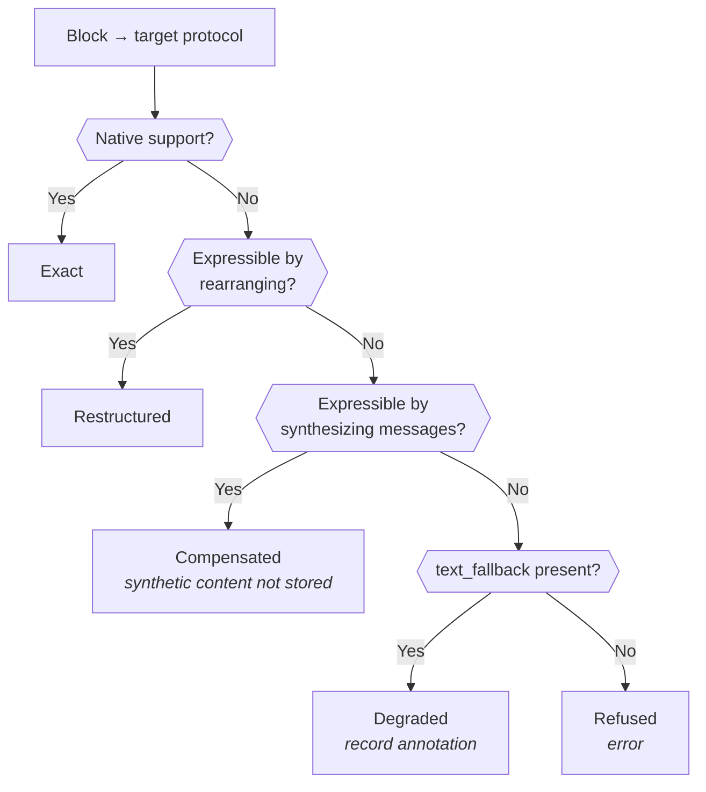

# MPSH Specification
## Minimal Portable Session History

**Status**: Authoritative definition of the canonical format. Supersedes the scattered definitions in `llm-protocol-comparison.md` §4, `llm-stateful-session-design.md` §4, and `implementation-plan.md` §2.

**Scope**: The canonical message format, its content block catalog, and the capability model that governs mapping to and from provider protocols. Does not cover the session tree, branching, or provider bindings.

---

## 1. The Central Claim

**Mapping between protocols is not format conversion. It is capability adaptation.**

The earlier comparison document assumed every protocol could express the same information in different arrangements. That is false. Concretely: Anthropic's `tool_result` accepts an array of content blocks including images, so a tool that returns a screenshot is natively expressible. Chat Completions requires tool results to be strings, so the same conversation can only be rendered by *inventing messages that never occurred* — a placeholder result plus a synthetic user turn carrying the image.

Three rules follow, and they shape everything below:

Rule                                                                |Consequence                                                                                                                                   
--------------------------------------------------------------------|----------------------------------------------------------------------------------------------------------------------------------------------
**MPSH is the union of provider capabilities, not the intersection**|Claude keeps image-bearing tool results even though OpenAI can't express them. An intersection format caps every provider at the weakest one  
**Mappers may synthesize; synthesized content is never stored**     |Protocol workarounds are rendering artifacts, with the same status as overlays. They must not travel with the session                         
**Loss must be visible**                                            |Silently dropping content produces a model answering confidently about something it never received. Every lossy mapping is recorded or refused

> **Evidence for the third rule.** A mature Python multi-provider client stores tool-result attachments faithfully and then **silently discards them** in both of its OpenAI mappers — the wire form carries only the text output, with no error and no record. Its capability model has a single outcome (validate-and-raise), so the tool-result case had nowhere to go and fell through. The alternative to explicit outcomes is not refusal; it is silence.

---

## 2. Structure

```
MPSH
├── system_prompt : text?
└── messages[]
    ├── role : user | assistant
    ├── content[] : ContentBlock
    └── provenance? : { provider, model, bias }
```

That is the whole top level. Deliberately smaller than the PSR — no tree, no branches, no bindings.

### Invariants

#|Invariant                                                |Rationale                                                                                                    
--|---------------------------------------------------------|-------------------------------------------------------------------------------------------------------------
1|Roles are `user` and `assistant` only                    |`system`, `developer`, `tool`, `model` are all provider spellings. None is stored                            
2|`content` is always a list                               |The string shorthand three protocols accept is a serialization convenience. Gemini has none, which settles it
3|Everything that any protocol models as content is a block|See §3                                                                                                       
4|Identifiers are MPSH's own                               |Provider IDs live in translation state, never in canonical content. See §5                                   
5|Binary payloads may be references                        |See §6                                                                                                       

---

## 3. The Field-vs-Block Rule

Protocols disagree about whether a concept is a message-level field or a content block. **When they disagree, MPSH stores the block form.**

Concept    |Chat Completions                                                    |Responses                  |Anthropic                                |Gemini                 |MPSH     
-----------|--------------------------------------------------------------------|---------------------------|-----------------------------------------|-----------------------|---------
Tool call  |`tool_calls` field on the assistant message                         |`function_call` item       |`tool_use` block                         |`functionCall` part    |**Block**
Tool result|`role: "tool"` message                                              |`function_call_output` item|`tool_result` block inside a user message|`functionResponse` part|**Block**
Reasoning  |`reasoning` / `reasoning_content` / `thinking` field, unstandardized|`reasoning` item           |`thinking` block                         |thought parts          |**Block**

The justification is asymmetry of effort: **hoisting a block into a message-level field is mechanical and lossless; splitting a field into blocks requires invention.** Storing the block form puts the easy direction in every mapper. Two of four protocols already agree with it natively.

This rules out modelling tool results as a message role — a design that only looks natural if Chat Completions is the only protocol in view.

---

## 4. Content Block Catalog

### Universal fields

Every block and every message carries an optional **`provider_metadata`**: a map keyed by provider name, holding data meaningful only to that provider.

```
provider_metadata: { "openai": {...}, "anthropic": {...} }
```

This replaces an earlier "portability class" scheme, and is better for one reason: **cross-provider drop happens automatically.** A mapper reads only its own key, so provider-specific data is left behind without any explicit drop logic to write or forget. The Anthropic mapper never sees OpenAI's encrypted reasoning payload because it never looks for it.

Use it for anything a provider needs echoed back but no one else can interpret: encrypted reasoning content, item IDs, thinking signatures, cache markers.

### Blocks

Kind         |Fields                                                             |Notes                                                                                                                                                                                                                                                                                                          
-------------|-------------------------------------------------------------------|---------------------------------------------------------------------------------------------------------------------------------------------------------------------------------------------------------------------------------------------------------------------------------------------------------------
`text`       |`text`                                                             |The only block every protocol handles identically                                                                                                                                                                                                                                                              
`image`      |`payload`, `media_type`, `text_fallback?`, `name?`                 |Payload per §6                                                                                                                                                                                                                                                                                                 
`audio`      |`payload`, `media_type`, `text_fallback?`, `name?`                 |`text_fallback` is typically a transcript, and is the difference between degradation and refusal                                                                                                                                                                                                               
`document`   |`payload`, `media_type`, `name`, `text_fallback?`                  |PDFs and similar                                                                                                                                                                                                                                                                                               
`tool_call`  |`call_id`, `name`, `arguments`, `server_executed`                  |Appears in assistant messages                                                                                                                                                                                                                                                                                  
`tool_result`|`call_id`, `content[]`, `is_error`, `exception?`, `server_executed`|Appears in user messages                                                                                                                                                                                                                                                                                       
`reasoning`  |`text?`, `redacted`, `provider_metadata?`                          |See below                                                                                                                                                                                                                                                                                                      
`refusal`    |`reason?`                                                          |Some protocols emit a distinct refusal channel rather than text. Carrying the reason as text to a protocol without that channel loses nothing — a past refusal is simply history, and the session replays as it happened. A refusal with no `reason` has nothing to carry, and that is the case worth recording

### `reasoning`: record the fact, not just the content

A reasoning block with `redacted: true` and empty `text` marks the case where a provider reports that reasoning occurred but withholds the content — OpenAI's encrypted reasoning items, Gemini without thought inclusion.

**Do not drop reasoning blocks on cross-provider handoff.** Dropping them silently alters message structure. Retain the block, let `provider_metadata` carry whatever the originating provider needs echoed back, and let the target provider's mapper ignore what it can't read. What survives a handoff is the structural fact that reasoning happened, plus any plain text; what's left behind is the opaque payload, automatically.

Some providers require reasoning items be replayed **unmodified** in later turns of the same session, particularly mid-tool-call. That is precisely what namespaced `provider_metadata` preserves — and it is the one place where dropping foreign reasoning is not cosmetic. Between a tool call and its result, an absent reasoning item breaks the turn rather than trimming it, so that position alone maps to **Refused**.

Elsewhere, handing foreign reasoning to a provider that cannot read it is **Restructured**, not Degraded. The block survives in MPSH, a later return to the originating provider replays it intact, and the only thing the new provider misses is working it could never have interpreted.

#### Retention is a separate axis

Whether reasoning *can* be carried is capability. Whether the caller *wants* it replayed is not, and the two must not be conflated.

At least one model family asks that reasoning be dropped once a turn closes, while requiring it within an open one. That is a playback preference, expressible against any protocol, and implementations should offer it as such: retain all reasoning, retain only within the open turn, or retain none.

A **turn** runs from one genuine user input to the next. A tool result rides in a user-role message but is not user input and does not open a turn — a rule phrased per-turn that segments on role instead will cut a tool-calling exchange in half. Retention applies only to *completed* turns, which is why the mid-tool-call case above needs no separate guard.

Reasoning omitted by retention is **not an annotation**. Annotations record loss the caller did not ask for; requested trimming is counted instead. Mixing them makes the annotation channel worthless, since a reader can no longer distinguish damage from choice.

> **Open**: this requirement is *model*-specific, while everything else here is keyed on protocol. Whether a model catalog should exist independent of protocol, and what minimal preference set it carries, is deliberately unresolved. The constraint on any such catalog: a preference may only ask for *less* than the protocol can carry. One that can override capability is a back door around this model.

### `server_executed`: tools the provider ran

Both `tool_call` and `tool_result` carry a `server_executed` flag marking tools executed **inside the provider's infrastructure** — Anthropic's web search, Gemini's code execution — rather than dispatched by the client.

?                        |Client-executed         |Server-executed                                
-------------------------|------------------------|-----------------------------------------------
Who runs it              |Your tool framework     |The provider                                   
Arrives as               |A call awaiting a result|A call *and* its result, already complete      
Client must execute it   |✅ Yes                   |❌ **Never** — re-execution is a correctness bug
Portable across providers|✅ Generally             |❌ Rarely — mostly no equivalent elsewhere      

This is a distinct category, not a variation. A client that treats a server-executed call as work to dispatch will attempt to run a tool it does not have. On handoff, server-executed pairs are usually **degraded to text** — the result content survives as conversation, the tool framing does not — because the target provider has no equivalent capability to invoke.

### `tool_result.content` is a nested block list

The single most consequential shape decision in the catalog. It matches Anthropic natively, and it is what makes an image-returning tool representable at all. A string-typed result makes the capability permanently unreachable *regardless of which provider you're talking to*.

> **Open question.** A mature Python multi-provider client models this as a flat `output: str` plus an `attachments: []` sidecar. That is simpler, but cannot express interleaved content (text, image, text) and requires assembly when mapping to Anthropic. This specification takes the nested form; the trade is real and worth revisiting if the recursive type proves awkward in Crystal.

### `text_fallback` is the degradation mechanism

Not documentation. Without it, an audio block reaching a text-only provider can only be refused; with it, the mapping degrades to a transcript. Populate at ingest wherever possible.

---

## 5. Identity

Provider-issued identifiers must not enter canonical content.

Concern          |Wrong                        |Right                                                                     
-----------------|-----------------------------|--------------------------------------------------------------------------
Tool call pairing|Store OpenAI's `tool_call_id`|Mint an MPSH `call_id`; keep provider IDs in per-binding translation state

The reason is concrete. OpenAI issues `call_...` IDs, Anthropic issues `toolu_...` IDs, and Gemini historically pairs `functionCall` to `functionResponse` by **function name and ordering, with no ID at all**. A session that starts on OpenAI and continues on Gemini needs pairing information that a stored OpenAI ID cannot supply, and a Gemini-originated session has no ID to store in the first place.

MPSH owns the identifier; each provider binding holds a translation table (`mpsh_call_id ↔ provider_call_id`) alongside its session handle. Both are disposable optimization state under the same lifecycle rules.

Retrofitting this is unusually painful because existing sessions won't carry the IDs, so it belongs in the first version of the format.

---

## 6. Payloads: Inline or Reference

Binary content blocks carry a `payload` that is one of:

Form       |Contents                                  |Used when                                         
-----------|------------------------------------------|--------------------------------------------------
`inline`   |base64 bytes                              |Small payloads, or after materializing a reference
`reference`|content-addressed handle into a blob store|Default for anything non-trivial                  

Both forms always carry `media_type` and `byte_size`.

**Store raw base64 and a separate media type — never a `data:` URI.** Anthropic and Gemini both want the parts separated; the two OpenAI protocols want them fused. Synthesizing a URI at map time is trivial string concatenation; parsing one back out is error-prone. Store the strict form.

References matter more than they first appear. Inlining base64 into stored history means every replay carries the full payload forever — which collides directly with the payload-size problem that motivated stateful sessions in the first place, and audio makes it materially worse than images ever did. Statefulness avoids *resending*; references keep what you do send small. They are complementary, and adding references after four mappings exist means touching all four.

---

## 7. Capability Model

### Mapping outcomes

Every (block, protocol) pair resolves to exactly one outcome:

Outcome         |Meaning                              |Stored?                                   
----------------|-------------------------------------|------------------------------------------
**Exact**       |Native support, direct translation   |—                                         
**Restructured**|Same information, different shape    |—                                         
**Compensated** |Synthesized messages preserve meaning|Synthesized content **never** written back
**Degraded**    |Information lost; substitute used    |Loss recorded as an annotation            
**Refused**     |Cannot map; fail loudly              |Nothing sent                              



### Capability granularity

Declare capability **per media type, not per block kind.** "Supports images" is too coarse — a model may accept PNG and JPEG but not WEBP, or PDFs but not DOCX. An implementation's declaration should carry an accepted media-type set, and mapping should test the block's actual `media_type` against it.

Kind-level capability remains meaningful only for non-payload blocks (`tool_call`, `tool_result`, `reasoning`).

### Capability matrix

Values below are a starting point, not a source of truth — **each implementation must confirm against current provider documentation**, since capabilities change more often than protocol shapes do.

Block                                          |Chat Completions                     |Responses                                      |Anthropic                          |Gemini                      
-----------------------------------------------|-------------------------------------|-----------------------------------------------|-----------------------------------|----------------------------
`text`                                         |Exact                                |Exact                                          |Exact                              |Exact                       
`image` (in user message)                      |Restructured (data URI)              |Restructured (data URI)                        |Exact                              |Exact                       
`audio` (in user message)                      |Restructured, model-gated            |Restructured, model-gated                      |**Refused** → degrade to transcript|Exact                       
`document`                                     |Restructured                         |Restructured                                   |Exact                              |Exact                       
`tool_call` (client)                           |Restructured (hoist to field)        |Restructured (item)                            |Exact                              |Exact                       
`tool_result` (text only)                      |Restructured (`role: "tool"` message)|Restructured (item)                            |Exact                              |Exact                       
**`tool_result` (containing image)**           |**Compensated**                      |**Compensated**                                |**Exact**                          |Verify — likely compensated 
`tool_call` / `tool_result` (`server_executed`)|**Degraded** → text                  |Provider-specific; exact only for its own tools|Exact only for its own tools       |Exact only for its own tools
`reasoning` (foreign)                          |Restructured                         |Restructured                                   |Restructured                       |Restructured                
`reasoning` (own provider)                     |Exact                                |Exact                                          |Exact                              |Exact                       
`reasoning` (foreign, mid-tool-call)           |**Refused**                          |**Refused**                                    |**Refused**                        |**Refused**                 
`refusal` (with `reason`)                      |Restructured → text                  |Restructured → text                            |Restructured → text                |Restructured → text         
`refusal` (no `reason`)                        |**Degraded**                         |**Degraded**                                   |**Degraded**                       |**Degraded**                

Three rows deserve attention. The **image-bearing tool result** is what forced this entire model, and demonstrates why the union rule is right: an intersection format would have deleted a capability Claude offers natively to accommodate a protocol that lacks it. The **server-executed** row shows a capability that is exact for exactly one provider and degrades everywhere else — the sharpest case of an asymmetry a format-conversion model cannot represent. The **foreign reasoning** row was Degraded in v1.1 and is corrected here: nothing leaves MPSH, since the block is retained and only the unreadable payload is shed by namespacing. Calling it a loss would make `strict` refuse every cross-provider handoff of a reasoning-model session — precisely the move this format exists to permit.

### Compensation, illustrated

A tool returns a screenshot. The canonical form is one user message containing a `tool_result` block whose nested content is `[text, image]`.

Target              |Rendering                                                                                                             
--------------------|----------------------------------------------------------------------------------------------------------------------
**Anthropic**       |One user message, `tool_result` with `content: [text block, image block]`. Exact                                      
**Chat Completions**|A `role: "tool"` message whose content is a placeholder string, **plus a synthesized user message** carrying the image

The second rendering is two messages where the conversation had one. Those two messages are **request-time output only**. What returns to MPSH is the assistant's reply — never the scaffolding that made the request legal.

### Structural adaptations: the second axis

The matrix above is block-centric. Some adaptations are not: merging consecutive same-role messages, prepending a placeholder when history opens with the assistant, and relocating the system prompt all operate on the message *sequence*.

Adaptation                               |Outcome        |Why                                                                         
-----------------------------------------|---------------|----------------------------------------------------------------------------
Move system prompt to its protocol's home|Restructured   |Placement differs; content does not                                         
Merge consecutive same-role messages     |**Compensated**|One-way. Three messages become two and export cannot know where the seam was
Prepend user placeholder                 |**Compensated**|A message that never occurred                                               
Drop empty message                       |Degraded       |Content removed to satisfy a validator                                      

The merge classification matters for conformance rather than aesthetics. Joining two user messages is not round-trippable, so declaring it Restructured makes the fixture fail permanently and read as a mapper bug. Declared Compensated, the matrix predicts the divergence and the fixture asserts it. The classification also carries the right instruction: a merged message is wire-only and must never be written back, which is what stops one provider's alternation workaround travelling to a provider that never needed it.

A useful consequence: under **strict**, a protocol requiring alternation refuses non-alternating history rather than quietly reshaping it.

### Degradation policy

Which outcomes are acceptable is a session-level policy, not a mapper decision:

Policy          |Behavior                                                                                  
----------------|------------------------------------------------------------------------------------------
**Strict**      |Refuse on anything below Restructured. Suited to agents where silent loss corrupts results
**Compensating**|Allow Compensated; refuse Degraded                                                        
**Lenient**     |Allow Degraded, recording each occurrence                                                 

Degradation events are recorded as **annotations** — the same off-path metadata category defined for rankings in the branching document. They are not conversation content, must never enter the linearization path, and exist so that a session's fidelity history is auditable after the fact.

---

## 8. Export: Protocol → MPSH

Every implementation must map in both directions. The export direction has obligations the import direction doesn't:

Obligation                      |Detail                                                                                                        
--------------------------------|--------------------------------------------------------------------------------------------------------------
Normalize roles                 |`model`, `developer`, `tool` → canonical roles; tool results become blocks in a user message                  
Mint MPSH identifiers           |Record `provider_id → mpsh_id` in binding translation state                                                   
Split fused representations     |A `data:` URI becomes raw base64 plus a media type                                                            
Un-hoist fields into blocks     |`tool_calls` field → `tool_call` blocks                                                                       
Namespace provider data         |Anything not canonically representable goes under `provider_metadata[<provider>]`, never into canonical fields
Flag server-executed tools      |Provider-run tool calls and results marked `server_executed: true` so no client ever dispatches them          
Preserve redacted reasoning     |Reasoning that occurred but was withheld becomes `reasoning(redacted: true)`, not an omission                 
Discard compensation scaffolding|A synthetic user message this client generated must not be re-imported as if it were real                     

That last one is only achievable if compensation is generated at map time and never round-tripped. It is the practical reason rule 2 of §1 is stated as an invariant rather than a guideline.

---

## 9. Conformance

**Round-trip fidelity**: an MPSH conversation mapped to a protocol and exported back must reproduce the original exactly — *except* where the capability matrix declares the mapping Compensated or Degraded, in which case the divergence must match what the matrix predicts.

This is stronger than the plan's original formulation. A round-trip failure is now one of three things, and naming which is mandatory:

Failure                  |Meaning                            |Action                                   
-------------------------|-----------------------------------|-----------------------------------------
Mapping bug              |Implementation error               |Fix the mapper                           
Undeclared capability gap|Matrix is wrong                    |Update the matrix                        
Genuine MPSH gap         |Format can't express something real|**Format change** — expensive, deliberate

Fixture set, extending the plan's:

Fixture                                                                |Targets                                                               
-----------------------------------------------------------------------|----------------------------------------------------------------------
Single user turn; multi-turn alternating                               |Baseline                                                              
System prompt present / absent                                         |Placement rules                                                       
Consecutive same-role; assistant-first                                 |Anthropic's alternation and first-user rules                          
Single vs. multiple text blocks                                        |Shorthand handling; Gemini's lack of it                               
Text + image in one user message                                       |Content-block path                                                    
Tool call → text result                                                |Field-vs-block hoisting, ID translation                               
**Tool call → result containing an image**                             |Compensation; the synthetic message must not round-trip               
**Server-executed tool call + result**                                 |Never dispatched; degrades to text on providers without the capability
Audio with transcript / without                                        |Degrade vs. refuse                                                    
Reasoning with text / redacted / with provider payload                 |Structural retention; namespaced payload dropped cross-provider       
Block carrying `provider_metadata` for a *different* provider          |Must be ignored, not misread                                          
Unsupported media type within a supported kind                         |Per-MIME capability, not per-kind                                     
Reference payload                                                      |Materialization at map time                                           
Empty / whitespace-only message                                        |Divergent provider handling                                           
**Refusal block with and without `reason`**                            |Restructured vs. Degraded                                             
**Consecutive same-role messages, alternation-requiring profile**      |Must assert the *predicted* Compensated divergence, not fidelity      
**Reasoning under each retention mode, with an open tool-calling turn**|Turn segmentation; the open turn is never trimmed                     

All structural. No API key, no model, no network.

---

## 10. Checklist

- [ ] Roles canonical; no provider spellings stored
- [ ] Content always a list
- [ ] Tool calls and results are **blocks**, not message roles or fields
- [ ] `tool_result.content` is a nested block list, not a string
- [ ] `tool_result` carries `exception` distinct from `is_error`
- [ ] `server_executed` on both `tool_call` and `tool_result`; never dispatched by the client
- [ ] MPSH mints its own `call_id`; provider IDs in binding translation state
- [ ] `provider_metadata` available on every block and message, keyed by provider name
- [ ] Reasoning retained structurally, including `redacted` with no text
- [ ] Binary payloads support inline and reference forms
- [ ] Raw base64 + separate media type; no `data:` URIs in storage
- [ ] `text_fallback` on every binary block
- [ ] Capability declared **per media type**, not per block kind
- [ ] Capability matrix declared per implementation, verified against live docs
- [ ] Compensation synthesized at map time, never written back
- [ ] Degradation recorded as annotations; refusal is a real outcome
- [ ] Foreign reasoning is Restructured, not Degraded; Refused only mid-tool-call
- [ ] Refusal carries its reason as text where there is no refusal channel
- [ ] Structural adaptations classified; merge and placeholder are Compensated
- [ ] Reasoning retention offered as a playback preference, counted and not annotated
- [ ] Round-trip conformance distinguishes bug / matrix error / format gap

---

**Document Version**: 1.2
**Last Updated**: 2026-08-17
**Changes from 1.1**: Four rulings from Phase 0 implementation review. Foreign `reasoning` corrected from Degraded to Restructured, with Refused reserved for the mid-tool-call position. `refusal` given explicit outcomes: Restructured with a reason, Degraded without. Structural adaptations added as a second axis, classifying message merges and placeholders as Compensated. Reasoning retention introduced as a playback preference distinct from capability, with turn segmentation defined and the model-catalog question recorded as open. Three fixtures added.
**Changes from 1.0**: Portability class replaced by namespaced `provider_metadata`. Added `server_executed`, `redacted` reasoning, `tool_result.exception`. Capability granularity moved to per-media-type. Prior-art evidence added for the loss-visibility rule.
