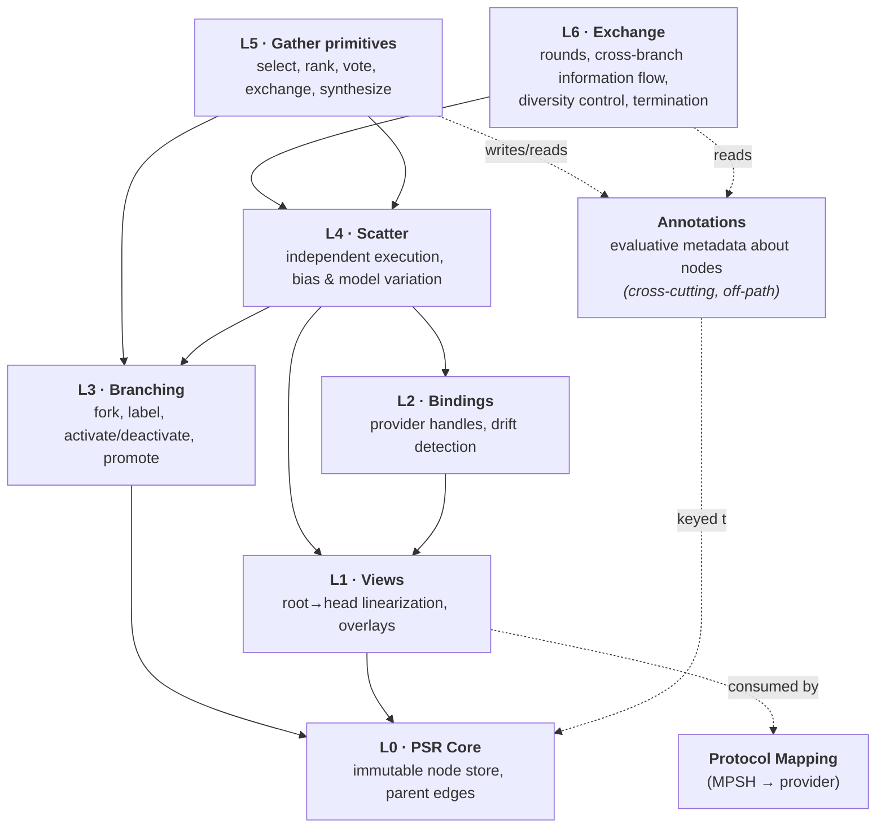
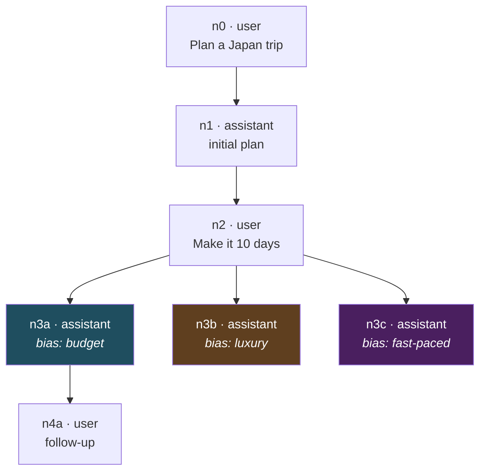
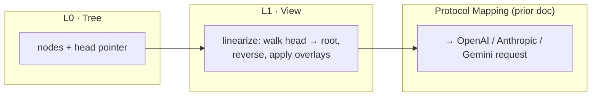
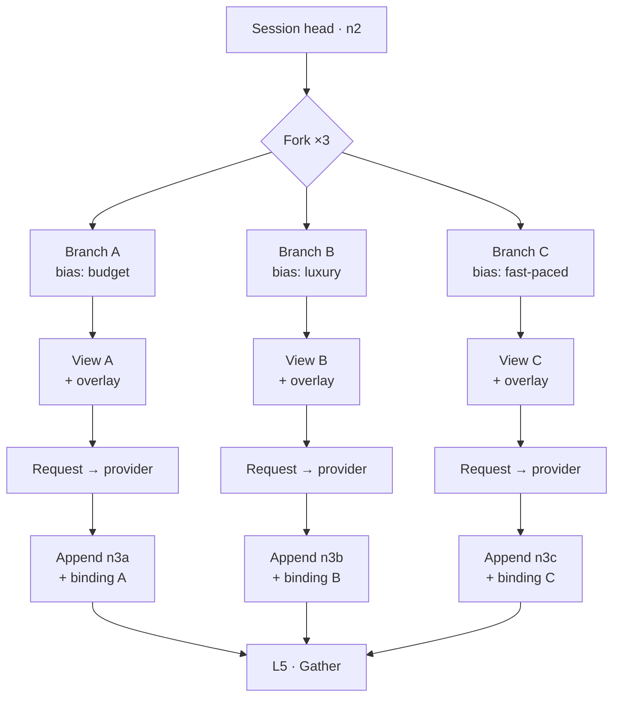
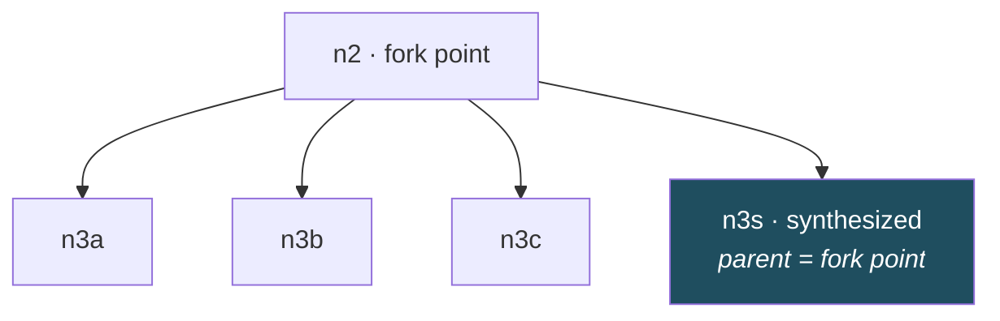
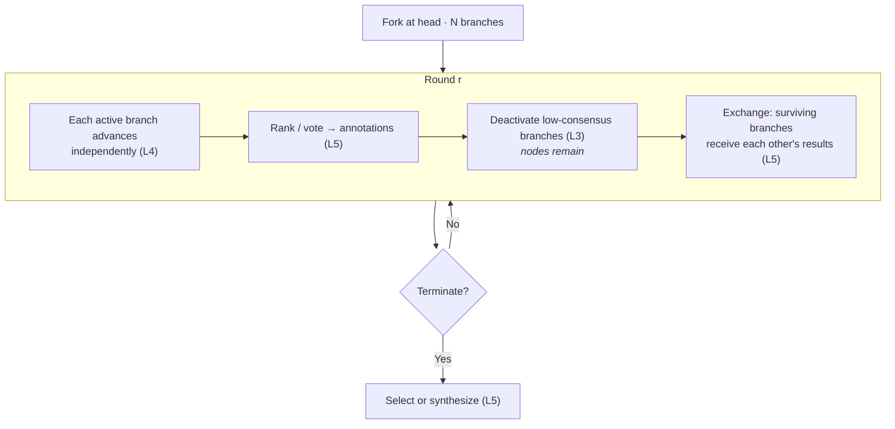

# PSR Branching & Scatter/Gather Design
## A Composable Module Stack

**Purpose**: Extend the Portable Session Record so a session can fork after any turn, run several forks in parallel under different biases, and then reduce the results back into the session.

**Relationship to other documents**:
- `MPSH_SPECIFICATION.md` — the canonical message format and capability model (authoritative)
- `LLM_PROTOCOL_COMPARISON.md` — per-turn protocol mapping (stateless)
- the stateful-session design — PSR, provider bindings, cross-provider handoff; not yet in this repository
- **This document** — restructures the PSR core to support branching, then layers capabilities on top

> **Status: deferred.** Nothing in this document is implemented. The shard
> currently builds Phase 0-2 of `IMPLEMENTATION_PLAN.md`, which stops at a flat
> canonical message list; the layer stack below arrives at Phase 5 and after.
> It is in the repository for two reasons: it is the source of the **annotation**
> concept that Phase 0 already implements, and it is where the **view seam** —
> the reason protocol mapping consumes a flat list — is argued. Read it as
> background, not as a worklist.

**Up front, one honest note**: this is not purely additive. The earlier PSR stored `messages[]` as a flat array. Branching requires a tree. §2 covers the change and the migration; the flat array turns out to be a degenerate case of the new structure, so nothing is lost — but the core does change shape.

---

## 0. Relationship to Phase 0

This document predates `MPSH_SPECIFICATION.md` and refers throughout to "the
protocol-mapping document" and to canonical content blocks "from prior
documents". Read all such references as pointing at **MPSH**, which is now the
authoritative canonical format. A node's `content[]` *is* an MPSH content block
list; this document does not define a second one.

Three points of contact with what is already built:

Concept here                                                               |Phase 0 today                                   |Reconciliation                                                                                                                                                                                                                                                                                              
---------------------------------------------------------------------------|------------------------------------------------|------------------------------------------------------------------------------------------------------------------------------------------------------------------------------------------------------------------------------------------------------------------------------------------------------------
**L1 view** — a flat, ordered message list produced by walking head to root|`MPSH::Session`, a flat message list            |The flat session is the degenerate case of §2's tree, exactly as the migration note describes. Mappers already consume a linearization and are branch-unaware; no mapper changes when the tree arrives                                                                                                      
**Annotations** — evaluative metadata about nodes                          |`MPSH::Annotation`, recording degradation events|**One channel, two entry shapes.** Both are persisted, never linearized, and never sent to a provider. Ranking entries key on `(round, ranking_branch, ranked_node)`; degradation entries key on `(outcome, provider, message_index, block_kind)`. Phase 5 widens the type; it does not add a second channel
**`provenance`** — provider, model, applied bias                           |`MPSH::Provenance`, the same three fields       |§7 additionally wants contributing branch heads recorded for synthesized nodes. That is a Phase 5 extension of the struct, not a disagreement                                                                                                                                                               

The one thing worth carrying forward now: **annotations must never enter the
linearization path.** Phase 0 holds to this, and every layer below depends on
it.

---

## 1. Module Stack

You asked for composable modules you could assemble later. The dependency direction is strictly downward — every layer depends only on layers beneath it, never sideways or upward.

Layer                     |Responsibility                                                           |Depends on|Usable standalone?                                     
--------------------------|-------------------------------------------------------------------------|----------|-------------------------------------------------------
**L0 · Core**             |Immutable nodes, parent edges, identity                                  |—         |✅ Yes — a plain linear session works with L0+L1 only   
**L1 · Views**            |Turn a head node into a linear message list; apply non-persisted overlays|L0        |✅ Yes                                                  
**L2 · Bindings**         |Provider handles, TTL, drift checks                                      |L1        |✅ Optional — omit it and everything is stateless replay
**L3 · Branching**        |Fork at a node, label, activate/deactivate, promote                      |L0        |✅ Optional                                             
**L4 · Scatter**          |Advance N branches independently under differing models and/or biases    |L1, L2, L3|Requires L3                                            
**L5 · Gather primitives**|Select, rank, vote, exchange, synthesize                                 |L3, L4    |Requires L4                                            
**Annotations**           |Evaluative metadata *about* nodes, never on the linearization path       |L0        |Cross-cutting                                          
**L6 · Exchange**         |Multi-round loops: scatter → gather → redistribute → repeat              |L4, L5    |Requires L5                                            

In Crystal terms, this maps cleanly onto modules mixed into a session object, with each capability module declaring what it requires from the layers below. L0–L1 is the minimum viable PSR; everything above is opt-in. A consumer that only wants the prior document's behavior includes L0, L1, and L2 and never touches L3+.

### Primitives, not strategies

A deliberate constraint on this stack: **L0–L5 provide primitives; L6 and above compose them into strategies.** No layer below L6 should encode a particular research method. The multi-round scheme in §8 is one composition of these primitives — a useful one, and the motivating example for this document — but the tree is not *for* it. Branching history serves a much wider range of uses (regeneration, what-if exploration, A/B comparison of models, auditable decision trails, recovering from a bad turn) and each of those wants a different composition of the same underlying operations.

The test for whether a piece of behavior belongs below L6: could a different strategy reasonably want the opposite? If yes, it's a strategy decision, not a primitive.

---

## 2. L0 — PSR Core: From Array to Tree

### The change

&nbsp;          |Before (prior doc)          |After                                                
----------------|----------------------------|-----------------------------------------------------
Storage         |`messages[]` — ordered array|`nodes{}` — map of id → node, each with a `parent_id`
Position        |Array index                 |Node id                                              
"Current state" |End of array                |A **head** pointer at some node                      
Multiple futures|Impossible                  |Multiple nodes sharing one `parent_id`               

**Migration**: a flat array of N messages becomes N nodes in a single unbroken parent chain, with the head at the last one. A session that never branches is indistinguishable in behavior from the old design.

### Node shape

Field       |Purpose                                                                                             
------------|----------------------------------------------------------------------------------------------------
`id`        |Stable unique identifier                                                                            
`parent_id` |The node this one follows; `null` only for the root                                                 
`role`      |`user` / `assistant` (canonical roles, per `MPSH_SPECIFICATION.md`)                                 
`content[]` |Canonical content blocks — an MPSH content block list, per `MPSH_SPECIFICATION.md`                  
`created_at`|Timestamp                                                                                           
`provenance`|Which provider/model produced it, and under what bias (see §6) — critical once branches are compared

**Nodes are immutable once written.** Editing a turn doesn't mutate a node; it creates a sibling with the same parent. This is what makes "regenerate this answer" and "branch here" the same operation underneath, and it's what guarantees a branch can never corrupt its siblings.

### Structure

Three siblings share parent `n2` — three parallel futures of the same conversation. Only `n3a` has been continued so far.

---

## 3. L1 — Views: The Bridge to Protocol Mapping

A **view** is a head node plus the walk back to the root. It produces exactly the flat, ordered MPSH message list the mappers already know how to translate.

This is the seam that keeps everything else unchanged: **every protocol-specific rule from `LLM_PROTOCOL_COMPARISON.md` — Anthropic's alternation requirement, Gemini's `parts` wrapping, the `developer` role nuance — operates on a view and needs no awareness that branching exists.**

### Overlays

A view can carry **overlays**: modifications applied at linearization time that are *not* persisted as nodes.

Overlay type                    |Example                                |Persisted as a node?        
--------------------------------|---------------------------------------|----------------------------
System-prompt replacement/append|"Prioritize low cost"                  |❌ No                        
Sampling parameters             |temperature, top_p                     |❌ No                        
Provider/model selection        |route this view to Claude              |❌ No                        
Injected steering turn          |an extra user message: "Answer briefly"|✅ **Yes** — it's a real turn

That last row is the distinction that matters most for §6. An overlay is invisible to the conversation; an injected turn is part of it, and will still be there if the branch is later continued or handed to another provider.

---

## 4. L2 — Bindings, Revisited for Branches

Provider bindings from the prior document need one correction: **a binding belongs to a branch head, not to a session.**

&nbsp;      |Prior design                   |Branch-aware design                                  
------------|-------------------------------|-----------------------------------------------------
Binding key |`provider + model`             |`provider + model + head_node_id`                    
Drift marker|`bound_at_index` (array length)|`bound_at_node_id`                                   
Drift check |"has the array grown?"         |"is my head still the node this handle was bound to?"

The node-id check is strictly better than the index check — it catches a case the index check silently misses. Two sibling branches can both be at "length 4" while representing completely different conversations; an index comparison would consider a handle from one valid for the other, and you would silently continue the wrong branch. Node ids make that mistake unrepresentable.

**Consequence for scatter**: N parallel branches against the same provider need N independent handles. There is no sharing — each branch is a distinct conversation from the provider's point of view, even though they share a common ancestor prefix.

---

## 5. L3 — Branching Operations

Operation              |Effect                                                 |Notes                                                                           
-----------------------|-------------------------------------------------------|--------------------------------------------------------------------------------
**Fork(node, n)**      |Create n sibling branch heads whose parent is `node`   |The branches are empty until something is appended; forking itself costs nothing
**Label(branch, name)**|Attach a human-meaningful name                         |Essential once you have five branches and need to talk about them               
**Deactivate(branch)** |Branch stops advancing; all nodes remain               |The default meaning of "prune" in a search strategy                             
**Reactivate(branch)** |Branch may advance again                               |Cheap, because nothing was destroyed                                            
**Promote(branch)**    |Make this branch the session's primary head            |The other branches still exist; nothing is deleted                              
**Delete(branch)**     |Physically remove nodes and descendants                |Should also drop that branch's bindings                                         
**Compare(a, b)**      |Return the divergence point and each side's nodes since|Pure read; the input to most gather primitives                                  

Forking is cheap because nodes are immutable and shared — branches share their entire common ancestry by reference rather than by copy. Ten branches off a 200-turn conversation duplicate nothing; they add ten pointers.

### Deactivation is not deletion

These are two operations that are easy to conflate and shouldn't be:

&nbsp;                                   |Deactivate|Delete
-----------------------------------------|----------|------
Nodes remain in the tree                 |✅ Yes     |❌ No  
Branch advances on future rounds         |❌ No      |❌ No  
Available as context to other branches   |✅ Yes     |❌ No  
Readable when reviewing the session later|✅ Yes     |❌ No  
Reversible                               |✅ Yes     |❌ No  

When a search strategy says "prune the worst branches," it almost always means **deactivate** — stop spending tokens advancing them. It rarely means delete, because a failed attempt is still information: it can be handed to surviving branches as an approach that didn't work, it explains why the search went the way it did, and creative work in particular often circles back to an idea that looked weak two rounds earlier.

Deletion is a storage-reclamation decision, appropriate long after a session concludes. Keeping it separate from the search-strategy vocabulary prevents an irreversible operation from being invoked by a heuristic that only meant "deprioritize."

---

## 6. L4 — Scatter

Scatter = fork, then advance each branch independently under different conditions.

### Two peer motivations

Branches can differ along two independent dimensions, and neither is subordinate to the other:

&nbsp;                          |**Bias variation**                                      |**Model variation**                                          
--------------------------------|--------------------------------------------------------|-------------------------------------------------------------
What varies                     |System steering, sampling, tools — same model throughout|Different provider and/or model per branch                   
Question answered               |"How does this model respond to different framings?"    |"How do different models approach the same problem?"         
Shared prefix preserved?        |Depends on where the bias applies (see below)           |❌ Irrelevant — different providers don't share a cache anyway
Comparison is meaningful because|Only one variable moved                                 |Each model brings genuinely different training and behavior  

Model variation is the motivation that has no substitute: running a branch on Claude and another on a local model produces a comparison you cannot obtain any other way, and it's unavailable to a single-model system regardless of how cleverly it's biased. Prefix-caching economics simply don't apply to it, and that's fine — the value is in the diversity of the responses, not the cost of obtaining them.

Mixed scatters are legitimate too: branch A on model X with steering, branch B on model Y unsteered. Just be aware that you've then moved two variables at once, so differences between A and B aren't attributable to either alone (see *Fairness* below).

### Execution

Branches advance **independently**, not simultaneously — the design requires no concurrency at all. Sequential execution is entirely valid and is the realistic default for local models serving one request at a time. Where parallelism is available (hosted APIs, or a local server with capacity for concurrent requests) it's a throughput optimization the layer can take advantage of, not a correctness requirement.

The only ordering consideration is caching-related, and it applies to the narrow case of several branches hitting the *same* model with an identical shared prefix: the first request populates the cache and later ones read it, so a cold simultaneous fan-out gets cache writes where it could have had reads. For sequential execution this happens naturally. For cross-model scatter it doesn't apply at all.

### Bias taxonomy

Bias axis                        |Mechanism                                     |Overlay or node?           |Portable across providers?                         
---------------------------------|----------------------------------------------|---------------------------|---------------------------------------------------
**Model / provider**             |Route the view elsewhere                      |Overlay                    |N/A — this *is* the switch                         
**Sampling** (temperature, top_p)|Request parameter                             |Overlay                    |🟡 Roughly — semantics differ slightly per provider
**System-prompt steering**       |Replace/append the system prompt for this view|Overlay                    |✅ Yes                                              
**Injected steering turn**       |Prepend an extra user message                 |**Node**                   |✅ Yes, but permanently visible in that branch      
**Tool availability**            |Different tool set per branch                 |Overlay                    |🟡 Provider-dependent                              
**Seed / raw resample**          |Same everything, different sample             |Overlay (or nothing at all)|✅ Yes                                              

Record the applied bias in each resulting node's `provenance`. Without it, a gather step three turns later has no way to tell why the branches differ — and neither do you when reading the session back a week later.

### Flow

### Two properties worth designing for deliberately

**Fairness.** If the point of a scatter is to compare biases, hold *everything else* constant — same model, same parameters, same view prefix — and vary only the axis under test. A scatter that changes model *and* temperature *and* system prompt produces differences you can't attribute to anything.

**Cost, where it applies.** For same-model scatter, N branches from a common ancestor produce N requests sharing a byte-identical prefix — the shape prompt caching is built for:

Provider       |Behavior on a same-model scatter                                                                                                                 
---------------|-------------------------------------------------------------------------------------------------------------------------------------------------
**Anthropic**  |Strong fit — the shared prefix is a natural `cache_control` breakpoint; the first branch writes the cache, later ones read it at a steep discount
**OpenAI**     |Automatic prefix caching applies without explicit markup, provided the prefix is byte-identical                                                  
**Gemini**     |Explicit context caching available for the shared portion                                                                                        
**Self-hosted**|Route branches to the same replica (per prior doc §10) so the shared prefix is prefilled once                                                    

This is a real benefit worth capturing when it's available, but it is a property of *same-model* scatter only, and it should not shape the design of the scatter layer itself. A cross-model scatter forfeits all of it and remains equally valid.

**What breaks the shared prefix.** Worth knowing regardless of strategy, since it determines whether the above applies:

Bias applied…                                                        |Prefix preserved?
---------------------------------------------------------------------|-----------------
After the history — sampling parameters, model choice at request time|✅ Yes            
Within or before the history — system prompt changes, injected turns |❌ No             

---

## 7. L5 — Gather Primitives

"Gather" is not one operation. It's a small set of primitives that strategies compose. They divide cleanly by **whether N branches survive the operation**, which turns out to be the property that determines everything else:

Primitive     |What it does                                |Branches after|Writes a node?|Writes annotations?|Needs an LLM call?                  
--------------|--------------------------------------------|--------------|--------------|-------------------|------------------------------------
**Rank**      |Order branches by some criterion            |N             |❌ No          |✅ Yes              |🟡 Optional (judge model)           
**Vote**      |Aggregate rankings into a consensus ordering|N             |❌ No          |✅ Yes              |❌ No                                
**Exchange**  |Give each branch the other branches' results|N             |🟡 See §8     |❌ No               |❌ No (the branches' *next* turns do)
**Select**    |Choose one branch; promote it               |1             |❌ No          |❌ No               |🟡 Optional                         
**Synthesize**|Compose a new answer from all branches      |1             |✅ Yes         |❌ No               |✅ Yes                               
**Merge-diff**|Extract the non-overlapping parts of each   |1             |✅ Usually     |❌ No               |🟡 Optional                         

**The N-preserving primitives never produce a synthetic node.** This is the key structural point: only collapsing N→1 creates content that has no natural parent. Rank, vote, and exchange all leave the branch structure intact, so any nodes they lead to are written by the branches themselves, parented normally to their own predecessors. A strategy built entirely from N-preserving primitives — plus a terminal `select` — produces zero synthetic nodes from start to finish.

### Annotations

Rank and vote produce *evaluative metadata about nodes*, not conversation content. This is a third data category alongside nodes and overlays, and it needs its own home:

&nbsp;                   |Nodes                |Overlays                 |Annotations                                                
-------------------------|---------------------|-------------------------|-----------------------------------------------------------
Persisted                |✅                    |❌                        |✅                                                          
On the linearization path|✅                    |Applied at linearize time|❌ **Never**                                                
Sent to a provider       |✅                    |✅                        |❌ Not unless a strategy explicitly renders them into a turn
Example                  |"Here's my itinerary"|"be concise"             |"branch B ranked branch C first, round 2"                  

Keyed by `(round, ranking_branch, ranked_node) → score/position`. Keeping them off the linearization path is what prevents bookkeeping from polluting every branch's history — if rankings were injected as turns, each branch would carry a growing pile of scoring chatter that has nothing to do with the actual task, and every future request would re-send it.

### Where does a synthesized node attach?

This is the design decision with real consequences, and it's worth being deliberate about:

**Attach the synthesized node as another sibling of the fork point** — not as a child of any one branch. Reasoning:

- The result derives from all branches, so descending from one of them would misrepresent it
- The resulting path stays clean and linear: `n0 → n1 → n2 → n3s`, exactly what a view needs to linearize and what a downstream provider expects
- The source branches remain intact for inspection or later reuse

Record the contributing branch heads in the synthesized node's `provenance`. That's what makes the reduction auditable — and it's the only link back, since the node's `parent_id` deliberately points to the fork point rather than to its inputs.

### Cross-provider gathering

Because reduction consumes only canonical node content, the branches being reduced may come from *different providers*. A scatter can legitimately run branch A on Claude, branch B on an OpenAI model, and branch C on Gemini, then synthesize across all three — the reducer sees three sets of canonical content blocks and neither knows nor cares about their origin.

The stateful-session caveat still applies: opaque reasoning traces don't survive, so the reducer works from visible content only. For a gather step this is usually the right level anyway.

---

## 8. L6 — Multi-Round Exchange

A strategy layer that composes the primitives below it into a loop: scatter, evaluate, redistribute, advance, repeat. This is *one* strategy among many the stack can support — presented here because it exercises nearly every primitive and surfaces the design tensions worth knowing about.

### Round structure

Every step maps to a primitive from a lower layer. L6 contributes only the loop, the termination rule, and the diversity policy.

### How results actually enter a branch

The exchange step has to put sibling results somewhere, which is the overlay-vs-injected-turn choice again. Here, unlike the simple bias case, there's a defensible right answer:

&nbsp;                                          |Overlay                                               |Injected turn   
------------------------------------------------|------------------------------------------------------|----------------
Branch's next node is self-explanatory on replay|❌ No — it references content that isn't in its history|✅ Yes           
Survives handoff to another provider            |❌ No                                                  |✅ Yes           
Preserves shared prefix / caching               |✅ Yes                                                 |❌ No            
History growth                                  |None                                                  |Grows each round

**Use injected turns.** If sibling results arrive as an overlay, a branch will write things like "C's routing is more efficient than mine" — and nothing in that branch's stored history says what C proposed. The node becomes unreadable on replay and unportable to another provider, because the context that produced it is gone. That defeats the PSR's central purpose. The costs are real and worth accepting: history grows each round, and prefix sharing across branches is lost the moment each branch receives different injected content.

### Diversity: the failure mode of this strategy

Once every branch sees every other branch's output each round, branches converge. By round three you may have N branches expressing nearly the same thing — you've paid N times over for one answer, and the diversity that justified branching is gone. This is the well-known failure of multi-agent debate arrangements, and it arrives quietly: each individual round looks like healthy refinement.

Mitigation          |Mechanism                                                   |Cost                                                                       
--------------------|------------------------------------------------------------|---------------------------------------------------------------------------
**Held-out branch** |One branch never receives exchanges                         |Loses the benefit of cross-pollination for that branch — which is the point
**Anonymize**       |Strip model/branch identity from exchanged results          |Prevents deference to a perceived "better" model                           
**Partial exchange**|Each branch sees a subset, not all N                        |Slower information spread, more retained variance                          
**Alternate rounds**|Exchange every other round                                  |Branches get a round to develop independently                              
**Asymmetric bias** |Re-apply each branch's original steering after each exchange|Steering counteracts drift toward the mean                                 

Cross-model scatter has a natural advantage here: different models converge more slowly than one model under different framings, because their differences are architectural rather than promptual. Model variation is a diversity mechanism in its own right, not only a comparison mechanism.

**Measure it.** Divergence between branch outputs should be tracked per round, whatever the measure (embedding distance, ranking agreement, plain length/content overlap). Convergence you can observe is manageable; convergence you discover in the final output is not.

### Termination

An exchange loop has no natural stopping point, so a rule is required:

Rule           |Trigger                                    |Suits                                                        
---------------|-------------------------------------------|-------------------------------------------------------------
**Convergence**|Divergence drops below a threshold         |Consensus-seeking work — stop when further rounds add nothing
**Budget**     |Token/time/cost ceiling reached            |Bounded exploration                                          
**Round cap**  |Fixed N rounds                             |Predictable, easiest to reason about                         
**Stability**  |Top-ranked branch unchanged across k rounds|Ranking-driven searches                                      

Convergence works as both a quality signal and a stop condition, which is convenient — but note the tension with the section above: a strategy actively fighting convergence for diversity reasons can't also rely on it as its primary termination rule. Pick one role for it, and use a budget or round cap as the backstop.

### What L6 must *not* assume

Keeping the boundary honest — these are strategy choices, not primitives, and a different strategy will reasonably want the opposite:

- Whether pruning happens at all, and by what heuristic
- Whether exchange is full, partial, or anonymized
- Whether a round ends in select, synthesize, or simply continues
- How many branches, and whether that count is fixed across rounds
- Whether branches are model-varied, bias-varied, or both

None of this belongs below L6. The lower layers only need to make each of these expressible.

---

## 9. Composition Examples

Assemblies of the same modules, showing that the stack degrades gracefully and that the research strategy is only one consumer among several:

Use case                   |Modules   |Behavior                                                                        
---------------------------|----------|--------------------------------------------------------------------------------
Plain linear chat          |L0, L1    |Identical to a simple stateless client                                          
Linear chat, cost-optimized|L0, L1, L2|Prior document's design exactly                                                 
Regenerate / "try again"   |L0, L1, L3|Fork of width 1 at the last user turn; the previous answer survives as a sibling
Recover from a bad turn    |L0, L1, L3|Fork at an earlier node and continue; the bad path stays for reference          
What-if exploration        |L0, L1, L3|Manual branches the user navigates between; no automation                       
Model A/B comparison       |L0–L4     |One scatter round, model-varied, read the results directly — no gather needed   
One-shot best-of-N         |L0–L5     |Scatter, rank, select. Single round                                             
Multi-round exchange       |L0–L6     |The strategy in §8                                                              

Two things this table is meant to show. First, **"regenerate" needs no special machinery** — it's a fork of width 1, and the old answer survives as a sibling rather than being overwritten. Getting that for free is a good sign the tree is carrying its weight.

Second, **most of these uses have nothing to do with parallel research.** Branching history is independently valuable for navigation, recovery, comparison, and auditability. The research strategy in §8 sits at the top of the stack precisely so that it can be absent without diminishing any of the rest.

---

## 10. Design Checklist

**L0 · Core**
- [ ] Nodes are immutable; edits and regenerations create siblings, never mutations
- [ ] Every node carries `provenance` (provider, model, applied bias)
- [ ] Linear sessions remain a valid degenerate case of the tree

**L1 · Views**
- [ ] Linearization is the *only* thing protocol mapping consumes — mapping stays branch-unaware
- [ ] Overlays are never persisted; injected steering turns always are

**L2 · Bindings**
- [ ] Bindings key on `provider + model + head_node_id`
- [ ] Drift detection compares node ids, not lengths
- [ ] Pruning a branch prunes its bindings

**L3 · Branching**
- [ ] Forking shares ancestry by reference, never by copy
- [ ] Deactivate and delete are separate operations with separate vocabulary
- [ ] Search heuristics can only invoke deactivate, never delete
- [ ] Promote doesn't destroy siblings

**L4 · Scatter**
- [ ] Branches advance independently; concurrency is optional, not required
- [ ] Model variation and bias variation are peer capabilities
- [ ] Vary one axis at a time when the goal is attributable comparison
- [ ] Record the applied bias and model in provenance at write time

**L5 · Gather primitives**
- [ ] N-preserving primitives (rank, vote, exchange) write no synthetic nodes
- [ ] Annotations are stored off the linearization path and never sent to a provider by default
- [ ] Synthesized nodes attach to the fork point, not to a contributing branch
- [ ] Contributing branch heads are recorded in provenance
- [ ] Primitives operate on canonical content only, so mixed-provider gathers work

**L6 · Exchange**
- [ ] Exchanged results enter branches as injected turns, not overlays — self-containment beats prefix caching here
- [ ] At least one diversity mechanism is active whenever exchange is
- [ ] Divergence is measured per round, not inferred from the final output
- [ ] A termination rule exists, with a budget or round cap as backstop
- [ ] No strategy decisions leak below this layer

---

**Document Version**: 1.2

**Last Updated**: 2026-08-17

**Changes from 1.1**: Added deferred-status banner and §0 reconciling this document with MPSH and the Phase 0 implementation — the view seam, the single annotation channel, and `provenance`. References to "the prior document" retargeted to the named documents. Duplicate §9 heading renumbered.

**Scope**: Branching, scatter with model and bias variation, gather primitives, and multi-round exchange. Builds on and revises the PSR core from the stateful-session design.
