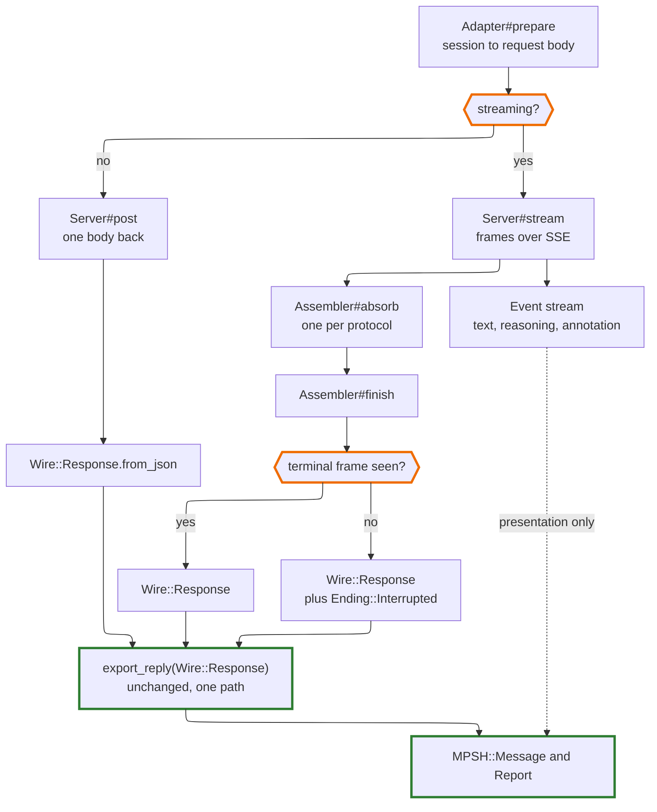

# Streaming Design

**Status**: designed, not built. Nothing described here exists yet. This is the
record of *why*, written before the code so the decisions are reviewable while
they are still cheap to change.

**Scope**: how a streamed response reaches an `MPSH::Message` — the transport
seam, per-protocol frame assembly, the event stream, and where the streaming
preference lives. Does not cover tool execution, retries, or session branching,
all of which stay out (see *Deliberately out of scope*).

**Why now**: three items are queued behind it. `SCOPE.md`'s last `MUST FIX`,
interrupted-turn repair, is held until streaming lands, because the case that
decides its design — a stream ending without its terminal frame — cannot exist
without one. Tool support sits behind that in turn.

---

## The seam already exists

This was designed for, twice over, before there was anything to put in it.

`Adapter::Exchange` splits a call into three steps rather than one, and says
why: *"`prepare` builds a body, `Server#post` sends it, `read` turns the result
into a message — three steps rather than one, so streaming can later slot
between the second and third without rewriting either."* `Server#post` and
`Client#transmit` each carry the same note.

The more valuable piece is quieter. Every exporter already has two entry
points:

```crystal
def export_reply(body : String) : MPSH::Message      # parses, then delegates
def export_reply(response : Wire::Response) : MPSH::Message
```

Translation is already decoupled from JSON parsing, in all four protocols.
Streaming does not need a new way to build a message. It needs a second way to
obtain a `Wire::Response`.

## The decision: assemble, then translate once

Frames merge into the protocol's own `Wire::Response`, and the existing
`export_reply(Wire::Response)` runs on it unchanged.



**The alternative was a streaming reader per protocol**, building an
`MPSH::Message` incrementally from frames. It is rejected because it duplicates
translation four times. Everything hard lives in those exporters: compensation
carrier absorption, tool-call pairing, reasoning retention, Gemini's ordinal
pairing in place of identifiers. The conformance suite covers exactly one path
through them. A second path is a second chance to be wrong in a way nothing
checks — which is the precise shape of the carrier bug that took three
implementations and one conformance divergence to find.

The cost is honest: four `Assembler`s, one per protocol, each merging frames
into one wire type. Mechanical work, testable offline against a recorded
transcript, and none of it touches MPSH.

**The guarantee this buys** is worth stating plainly, because it is what makes
the streaming preference a free choice everywhere else in this document: a
streamed reply and a non-streamed reply produce the *same* `MPSH::Message`.
Not equivalent — the same, by construction, because they meet at
`export_reply` having taken different routes only as far as the wire type.

## The four protocols are wildly uneven

Build in this order. Each assembler is independently testable, and by the
fourth the pattern has been proved three times.

Protocol        |Framing                                                                                         |Assembly                       
----------------|------------------------------------------------------------------------------------------------|-------------------------------
Responses       |Typed events; `response.completed` carries the whole response object                            |Nearly free — keep the last one
Gemini          |Each chunk is a complete `GenerateContentResponse`                                              |Easy — concatenate parts       
Anthropic       |`message_start` shell, indexed `content_block_delta`s, `message_delta` with `stop_reason`       |Moderate — merge by block index
Chat Completions|No shell; tool calls arrive as index-keyed fragments with arguments accumulated as string pieces|Hardest — merge by position    

Chat Completions last, deliberately. It is the one where inventing the shape
under pressure would go worst.

## Events are presentation

Emitted from frames as they arrive, never consulted for state.
`DEVELOPMENT.md`'s *Events are presentation; the session is state* already
governs this and is not restated here. Two of its rules bite immediately:

- **No terminal event.** Whether the model stopped or wants a tool is a fact
  about the reply. An assembler that emitted one would tempt every caller to
  branch on the thing that is not authoritative.
- **The event type is a closed union**, so a fifth event kind breaks every
  consumer until each says what it does.

## Where the streaming preference lives

**On `Client`, with a per-call override**, exactly like `policy` and
`retention`:

```crystal
client = Client.new(provider, streaming: true)
reply, report = client.send(session, model, streaming: false)
```

An application's configuration — a `session: { streaming: true }` block or
similar — becomes a constructor argument, and per-call override is free rather
than designed.

**Not on `MPSH::Session`.** The session is the portable archive. Whether frames
or one body arrived is not a fact about the conversation, and writing a
transport preference into a file another client reads back on a different
provider is the one placement that would be actively wrong.

**Not on `Options`.** `Options` means *what to ask the model for* —
temperature, `max_output_tokens`, things that change what gets generated.
Streaming changes none of that; the reply is identical either way. Mixing a
delivery preference into generation settings blurs a line currently kept clean,
and `stream` ending up as a body field is an implementation detail of the
protocol rather than a reason to reclassify it.

**Deployments get a say, as capability rather than configuration.** An endpoint
that cannot stream declares so in `Capability::Profile`, alongside everything
else it cannot do. A request to stream where the endpoint will not gets a
`Report` annotation and a non-streamed reply. Degrading loudly rather than
failing is what happens everywhere else here, and it means `streaming: true` in
an application's config never breaks a deployment that lacks it.

### Prompt caching is not affected

Investigated, because it was the obvious worry about flipping the flag
per call. Caching keys on the content prefix — system, tools, messages — not on
transport flags, and mechanically it cannot be otherwise: the cached thing is a
token prefix computed before generation begins, while frames-versus-body is
decided after. Switching mid-session costs no cache hits.

### What streaming *does* change

**Chat Completions omits `usage` from a streamed response** unless the request
sets `stream_options: {include_usage: true}`. A naive implementation silently
loses token counts from the `Report` — exactly the quiet fidelity loss this
design is arranged against. **The mapper must set that flag whenever it
streams.** Anthropic and Gemini both carry usage in their frames, which makes
this a single-protocol wrinkle and therefore an easy one to miss.

**Long generations are safer streamed.** Anthropic's documentation advises
streaming for large `max_tokens` because networks drop idle connections during
long generations; their SDKs turn that advice into a client-side error. A shard
speaking HTTP directly will not be refused, but the underlying risk is real,
and it is the best argument for per-call override existing at all: the caller
who just set `max_tokens` to 64,000 is the one who needs it.

## Errors arrive three different ways

The classes are set out in full in `SCOPE.md`'s interrupted-turn entry. What
streaming adds is the second and third.

1. **Pre-request rejection** — 429, 400, 413. Arrives as a status before any
   frame. `Server#error_for` classifies it unchanged.
2. **In-band error frame.** The outer status is already committed at 200, so a
   mid-generation failure arrives as an error frame in place of the terminal
   one. `TransportError`'s `status` would lie about this, so it wants a
   sibling: **`StreamError`**, carrying the frame's own error type. Keeping it
   apart preserves the distinction `TransportError`'s own comment insists on —
   a 429 is worth waiting on, this never will be.
3. **Silent truncation.** The stream simply ends with no terminal frame. No
   status, no error object, no vendor field: the fact is carried by an
   *absence*.

That third case is why interrupted-turn repair waited. A design that *derived*
"this turn was cut short" by normalising `provider_metadata` cannot express it,
because there is nothing to read. Whatever holds the fact must be settable from
a transport observation — which is the argument for a canonical `Ending` on
`MPSH::Message`, and it only becomes visible once streaming is in view.

## Testing

**Wiretap already records and replays SSE**, storing the full body as one
string with chunk boundaries preserved. Streaming specs are ordinary live
specs; no new machinery.

**The truncated-stream fixture is nearly free**: hand-truncate a recorded SSE
transcript. No fake server, no vendor, no money. It escapes the
"written by the same hand tests the hand" trap for once, because what is under
test is our parser's response to a cut byte stream rather than our belief about
what a vendor sends.

**Cost.** Flipping `stream` changes the request body, so Wiretap digests
differently and every streaming spec needs its own transcript — a doubling of
the live specs rather than an addition. Ollama first, all four protocols, free.
Then one paid recording per protocol, because Ollama's SSE is its own
approximation of each vendor's framing and proving the assemblers against it
alone would prove the wrong thing.

## Deliberately out of scope

- **Tool execution.** The turn loop stays the caller's. Streaming makes tool
  calls visible sooner; it does not make them the client's to dispatch.
- **Retries and reconnection.** A dropped stream is reported, not resumed.
  Resumption needs a server-side handle, which is the provider-owns-history
  model this design rejects.
- **Backpressure.** Frames are consumed as fast as they arrive.

## Open questions

- **Does the CLI stream by default?** `progress.cr` draws a spinner while
  waiting, which streaming makes obsolete. Streaming when stdout is a terminal
  seems right and matches how the progress renderer already decides, but it
  changes what `elelem start` looks like.
- **Do reasoning deltas reach the event stream when retention is `None`?**
  Retention governs what goes back to the *provider* next turn, not what a
  person may watch now. Probably yes — but getting it wrong leaks reasoning
  into a terminal someone believed was configured not to keep it.
