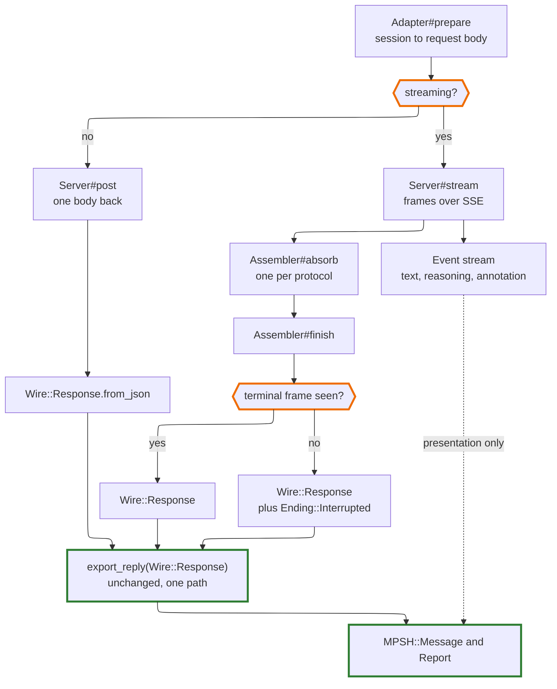

# Streaming Design

**Status**: designed, not built. Nothing described here exists yet. This is the
record of *why*, written before the code so the decisions are reviewable while
they are still cheap to change. The two questions this document originally
ended with are now answered — see *Settled before the first assembler*.

**Scope**: how a streamed response reaches an `MPSH::Message` — the transport
seam, per-protocol frame assembly, the event stream, and where the streaming
preference lives. Does not cover tool execution, retries, or session branching,
all of which stay out (see *Deliberately out of scope*).

**Why now**: three items are queued behind it. `SCOPE.md`'s last `MUST FIX`,
interrupted-turn repair, is held until streaming lands, because the case that
decides its design — a stream ending without its terminal frame — cannot exist
without one. Tool support sits behind that in turn.

---

## The seam already exists

This was designed for, twice over, before there was anything to put in it.

`Adapter::Exchange` splits a call into three steps rather than one, and says
why: *"`prepare` builds a body, `Server#post` sends it, `read` turns the result
into a message — three steps rather than one, so streaming can later slot
between the second and third without rewriting either."* `Server#post` and
`Client#transmit` each carry the same note.

The more valuable piece is quieter. Every exporter already has two entry
points:

```crystal
def export_reply(body : String) : MPSH::Message      # parses, then delegates
def export_reply(response : Wire::Response) : MPSH::Message
```

Translation is already decoupled from JSON parsing, in all four protocols.
Streaming does not need a new way to build a message. It needs a second way to
obtain a `Wire::Response`.

## The decision: assemble, then translate once

Frames merge into the protocol's own `Wire::Response`, and the existing
`export_reply(Wire::Response)` runs on it unchanged.



**The alternative was a streaming reader per protocol**, building an
`MPSH::Message` incrementally from frames. It is rejected because it duplicates
translation four times. Everything hard lives in those exporters: compensation
carrier absorption, tool-call pairing, reasoning retention, Gemini's ordinal
pairing in place of identifiers. The conformance suite covers exactly one path
through them. A second path is a second chance to be wrong in a way nothing
checks — which is the precise shape of the carrier bug that took three
implementations and one conformance divergence to find.

The cost is honest: four `Assembler`s, one per protocol, each merging frames
into one wire type. Mechanical work, testable offline against a recorded
transcript, and none of it touches MPSH.

**The guarantee this buys** is worth stating plainly, because it is what makes
the streaming preference a free choice everywhere else in this document: a
streamed reply and a non-streamed reply produce the *same* `MPSH::Message`.
Not equivalent — the same, by construction, because they meet at
`export_reply` having taken different routes only as far as the wire type.

## The four protocols are wildly uneven

Build in this order. Each assembler is independently testable, and by the
fourth the pattern has been proved three times.

Protocol        |Framing                                                                                              |Assembly                                 
----------------|-----------------------------------------------------------------------------------------------------|-----------------------------------------
Responses       |Typed events; finished items arrive whole, and `response.completed` carries the whole response object|Easy — collect items, terminal frame wins
Gemini          |Each chunk is a complete `GenerateContentResponse`                                                   |Easy — concatenate parts                 
Anthropic       |`message_start` shell, indexed `content_block_delta`s, `message_delta` with `stop_reason`            |Moderate — merge by block index          
Chat Completions|No shell; tool calls arrive as index-keyed fragments with arguments accumulated as string pieces     |Hardest — merge by position              

Chat Completions last, deliberately. It is the one where inventing the shape
under pressure would go worst.

## Building it: the library first, one protocol at a time

**This shard is a library that ships a CLI to prove itself, not a tool with a
library attached.** The order follows: everything below lands, is specced and
is stable before `elelem start` learns the word `stream`. A CLI built against
a seam still moving would have to be rebuilt, and — worse — would start
answering design questions that belong to the library by whichever way the
CLI happened to be written.

**Vertical slices, not a horizontal sweep.** The seam is not built once and the
four assemblers bolted on afterwards; each protocol is taken end to end and
stopped at, so a slice can be read, compiled and run before the next begins.
Reviewing four assemblers at once means reviewing none of them.

Slice|Carries                                                                                             |Free Ollama step?                             
-----|----------------------------------------------------------------------------------------------------|----------------------------------------------
1    |The seam — event union, `Server#stream`, `Client` flag, `StreamError` — plus the Responses assembler|Yes                                           
2    |Gemini assembler                                                                                    |**No** — Ollama has never served this protocol
3    |Anthropic assembler                                                                                 |Yes                                           
4    |Chat Completions assembler, plus `stream_options.include_usage`                                     |Yes                                           

Slice 1 is much the largest, because everything shared arrives with it. That is
the right place for the weight: the seam is proved against the protocol whose
assembler is the simplest of the four, so a failure there is unambiguously
the seam's.

**Slice 2 costs money on first contact and the others do not.** Ollama never
served Gemini, so unlike the rest there is no compatibility port to shake the
assembler out against before spending. Moving it after Anthropic was considered
and rejected.

Two things decided it. **Gemini is the cheapest place for a second opinion.**
Responses accumulates finished items, which is the simplest accumulation of the
four; Gemini's is the second, and getting two protocols to agree on the shape
before meeting a hard one is worth more than the order of the difficulty ramp.
Taking Anthropic second would mean debugging a new seam and the first stateful
index-merge at the same time. And **the re-record risk is smaller than it
looks**: `DEVELOPMENT.md`'s warning that re-recording re-cuts every turn applies
to *multi-turn* transcripts, and a first streaming spec is single-turn.
Reordering would have saved no money at all — only a modest chance of cutting
one short transcript twice — in exchange for a harder second slice.

### What each slice is tested against

**Per assembler, offline: frames in, `Wire::Response` out, asserted field by
field.** This is ordinary fixture work against a recorded transcript, and it is
the whole of what an assembler can be held to.

**Responses gets a real equality check, free — but only because it assembles.**
Its `response.completed` frame carries the entire response object, so an
independently accumulated result can be compared against the vendor's own
assembly of the same stream, on live data, with no hand-written expectation in
between. None of the other three offers this.

This is why the obvious shortcut was rejected. Keeping *only* the terminal frame
would make Responses trivial and would cost two things: the oracle becomes
vacuous, since comparing the terminal frame against itself checks nothing, and
`Turn#stop` returns nothing at all, because on this protocol the entire reply
lives in that one frame. A stop button that discards the answer is not a stop
button. So assemblers follow one rule — **assemble from complete units; deltas
are for events** — and here that means collecting `response.output_item.done`
frames, which arrive in exactly the shape the reader already takes. The partial
reply is then made of complete parts by construction, and a tool call still
receiving its arguments when the stream ended never enters a session, which is
the outcome repair would have had to arrange for anyway.

**The same-message guarantee stays structural, and is deliberately not
asserted.** It would be tempting to record a streamed and a non-streamed reply
to the same prompt and assert the two `MPSH::Message`s match. That test would
fail, and it would be right to: two generations differ. What is actually
guaranteed — one translation path — is enforced by construction rather than by
comparison, and the construction is checkable by reading: an assembler returns
the protocol's `Wire::Response` and nothing else, and `export_reply` has one
implementation. A test that appeared to check this would be checking the
model's determinism instead, which is worse than no test because it would
sometimes pass.

## Events are presentation

Emitted from frames as they arrive, never consulted for state.
`DEVELOPMENT.md`'s *Events are presentation; the session is state* already
governs this and is not restated here. Two of its rules bite immediately:

- **No terminal event.** Whether the model stopped or wants a tool is a fact
  about the reply. An assembler that emitted one would tempt every caller to
  branch on the thing that is not authoritative.
- **The event type is a closed union**, so a fifth event kind breaks every
  consumer until each says what it does.

## Where the streaming preference lives

**On `Client`, with a per-call override**, exactly like `policy` and
`retention`:

```crystal
client = Client.new(provider, streaming: true)
reply, report = client.send(session, model, streaming: false)
```

An application's configuration — a `session: { streaming: true }` block or
similar — becomes a constructor argument, and per-call override is free rather
than designed.

**Not on `MPSH::Session`.** The session is the portable archive. Whether frames
or one body arrived is not a fact about the conversation, and writing a
transport preference into a file another client reads back on a different
provider is the one placement that would be actively wrong.

**Not on `Options`.** `Options` means *what to ask the model for* —
temperature, `max_output_tokens`, things that change what gets generated.
Streaming changes none of that; the reply is identical either way. Mixing a
delivery preference into generation settings blurs a line currently kept clean,
and `stream` ending up as a body field is an implementation detail of the
protocol rather than a reason to reclassify it.

**Deployments get a say — but not in `Profile`, and not yet.** An earlier draft
of this document put the declaration on `Capability::Profile`, alongside
everything else an endpoint cannot do. That is the wrong home, for a reason
this shard has already met twice. `Profile` declares what a *protocol* can
express, and all four of these protocols stream; the field would read `true`
in four files and declare nothing. What actually varies is the deployment —
which is the shape `reasoning_unit` and `Wire::MaxTokensField` both took after
being tried protocol-wide first and moved.

**And the divergence to expect comes from emulators, not vendors.** Ollama's
SSE is its own approximation of each vendor's framing, and an emulator
supporting less than the protocol it imitates is the pattern behind half the
findings in `docs/servers/OLLAMA.md`. A canonical endpoint refusing to stream
is nearly unimaginable; a compatibility port that streams a thinner frame set,
or omits a field the canonical protocol carries, is close to expected.

So: **no declaration until a live call names one.** Declaring ahead of evidence
here is guessing, and guessing pessimistically would silently stop streaming
against endpoints that stream fine. When the first divergence arrives, the home
is a per-adapter override — same threading as `reasoning_unit` through
`Provider.for`/`.for_azure` — and the fallback is a non-streamed reply.

**The fallback is reported on `Report#streamed`, not as an annotation.** An
earlier draft of this section said annotation, and the code says otherwise:
`Report#record` raises on any outcome the policy disallows, and `Degraded` is
disallowed under both `Strict` and the default `Compensating`, so annotating a
fallback would refuse the request rather than describe it. The deeper reason is
that streaming is not a fidelity axis at all — a streamed reply and a
non-streamed one are the same `MPSH::Message` by construction, so nothing is
lost by not streaming and there is nothing for a channel meaning *loss* to
record. `Report#reasoning_dropped` is the precedent: a plain fact, on the
report, deliberately outside the annotation channel.

### Prompt caching is not affected

Investigated, because it was the obvious worry about flipping the flag
per call. Caching keys on the content prefix — system, tools, messages — not on
transport flags, and mechanically it cannot be otherwise: the cached thing is a
token prefix computed before generation begins, while frames-versus-body is
decided after. Switching mid-session costs no cache hits.

### What streaming *does* change

**Chat Completions omits `usage` from a streamed response** unless the request
sets `stream_options: {include_usage: true}`. A naive implementation silently
loses token counts from the `Report` — exactly the quiet fidelity loss this
design is arranged against. **The mapper must set that flag whenever it
streams.** Anthropic and Gemini both carry usage in their frames, which makes
this a single-protocol wrinkle and therefore an easy one to miss.

**Long generations are safer streamed.** Anthropic's documentation advises
streaming for large `max_tokens` because networks drop idle connections during
long generations; their SDKs turn that advice into a client-side error. A shard
speaking HTTP directly will not be refused, but the underlying risk is real,
and it is the best argument for per-call override existing at all: the caller
who just set `max_tokens` to 64,000 is the one who needs it.

## Errors arrive three different ways

The classes are set out in full in `SCOPE.md`'s interrupted-turn entry. What
streaming adds is the second and third.

1. **Pre-request rejection** — 429, 400, 413. Arrives as a status before any
   frame. `Server#error_for` classifies it unchanged.
2. **In-band error frame.** The outer status is already committed at 200, so a
   mid-generation failure arrives as an error frame in place of the terminal
   one. `TransportError`'s `status` would lie about this, so it wants a
   sibling: **`StreamError`**, carrying the frame's own error type. Keeping it
   apart preserves the distinction `TransportError`'s own comment insists on —
   a 429 is worth waiting on, this never will be.
3. **Silent truncation.** The stream simply ends with no terminal frame. No
   status, no error object, no vendor field: the fact is carried by an
   *absence*.

That third case is why interrupted-turn repair waited. A design that *derived*
"this turn was cut short" by normalising `provider_metadata` cannot express it,
because there is nothing to read. Whatever holds the fact must be settable from
a transport observation — which is the argument for a canonical `Ending` on
`MPSH::Message`, and it only becomes visible once streaming is in view.

## Testing

**Wiretap already records and replays SSE**, storing the full body as one
string with chunk boundaries preserved. Streaming specs are ordinary live
specs; no new machinery.

**The truncated-stream fixture is nearly free**: hand-truncate a recorded SSE
transcript. No fake server, no vendor, no money. It escapes the
"written by the same hand tests the hand" trap for once, because what is under
test is our parser's response to a cut byte stream rather than our belief about
what a vendor sends.

**Cost.** Flipping `stream` changes the request body, so Wiretap digests
differently and every streaming spec needs its own transcript — a doubling of
the live specs rather than an addition. Ollama first, all four protocols, free.
Then one paid recording per protocol, because Ollama's SSE is its own
approximation of each vendor's framing and proving the assemblers against it
alone would prove the wrong thing.

## Deliberately out of scope

- **Tool execution.** The turn loop stays the caller's. Streaming makes tool
  calls visible sooner; it does not make them the client's to dispatch.
- **Retries and reconnection.** A dropped stream is reported, not resumed.
  Resumption needs a server-side handle, which is the provider-owns-history
  model this design rejects.
- **Backpressure.** Frames are consumed as fast as they arrive.

## Settled before the first assembler

Both questions this document originally ended with are answered, and a third
surfaced while answering them. They sit at different layers, which is itself
the useful part: two constrain the library and one does not.

### Reasoning deltas reach the event stream regardless of retention — yes

**Library, and it gates the event union.** Not "probably yes": the existing code
has already decided it.

`Capability::Retention.plan` is called in exactly four places, all of them
inside `Mapper#map`. No exporter takes a retention argument. So under
`retention: None` today, a reply's `ReasoningBlock` is exported into the
`MPSH::Message`, handed to the caller, and — in the CLI — written to disk.
Retention drops reasoning only on the way *out*, on the following turn. Its own
doc comment says as much: a playback preference, not a capability.

Which makes suppression the incoherent option rather than the cautious one. An
event stream that omitted reasoning while the message delivered alongside it
contained reasoning would be a false account of what happened — breaking
*Events are presentation; the session is state* in the one direction that
matters, since the reply is authoritative and every caller is told to read it.
Events over-reporting relative to the reply is a nuisance; events
under-reporting it is a lie.

**The leak worry is real and belongs to a different control.** "I set
retention to `None` and reasoning still appeared in my terminal" is a
legitimate complaint, and the fix is a display default in whatever is doing the
displaying — not a suppression rule in the library. See the CLI half below.

**A third control does not exist, and retention is not it.** Retention governs
neither display nor storage: a reasoning block reaches the session and the
archive under every retention setting. Recorded in `SCOPE.md` so the next
reader does not assume otherwise.

### The CLI streams when stdout is a terminal — yes, and it waits

**CLI, and it constrains nothing in the library.** Settled early because it was
cheap, deferred to after the library because it is downstream of every piece of
it. The full record is in `docs/CLI_DESIGN.md`; the decision in three lines:
stream when **stdout** — not stderr — is a terminal, with an explicit
`--stream`/`--no-stream` that wins, and transport following rendering rather
than running ahead of it.

The one argument worth repeating here, because it is about this design rather
than the CLI's: **printed bytes precede repair.** Interrupted-turn repair
operates on the message and may drop content from it; it cannot un-print. The
tty rule confines that irreversibility to the case where a person is watching
and can see what happened, and guarantees that a redirected run — which is what
a script consumes — always receives the repaired reply.

### The event block takes `|event, turn|` from the first slice — yes

**Library, and it is public API in every example in the repository.** A third
question, surfaced by the first two: `DEVELOPMENT.md` sketches
`client.send(session) { |event, turn| … }`, where `turn` is `SCOPE.md`'s
cooperative stop handle — and that handle belongs to interrupted-turn repair,
which is queued *behind* streaming. So slice 1 has to pick one.

**It ships with both parameters.** Adding a second block parameter afterwards
changes every call site, every doc snippet and the README's own twenty-line
handoff, for no benefit over declaring it once. The handle has to live there
eventually regardless, since a signal the block can set is the whole point of
preferring cooperation to an exception raised through a mid-parse client.

**`turn` carries only `#stop` at first, and stopping is not repairing.** The
boundary matters, or repair gets dragged forward into a slice that cannot test
it. Slice 1 delivers: `turn.stop` sets a flag, the client stops consuming
frames at the next frame boundary, and finalisation proceeds normally — same
assembler, same `export_reply`, same `MPSH::Message`. A deliberately stopped
turn is therefore indistinguishable from a silently truncated one at this
stage, which is correct: both are a stream that ended early, and *what that
should mean* for a session carrying a half-finished tool call is exactly the
question `SCOPE.md`'s MUST FIX exists to answer. It is not answered here.
