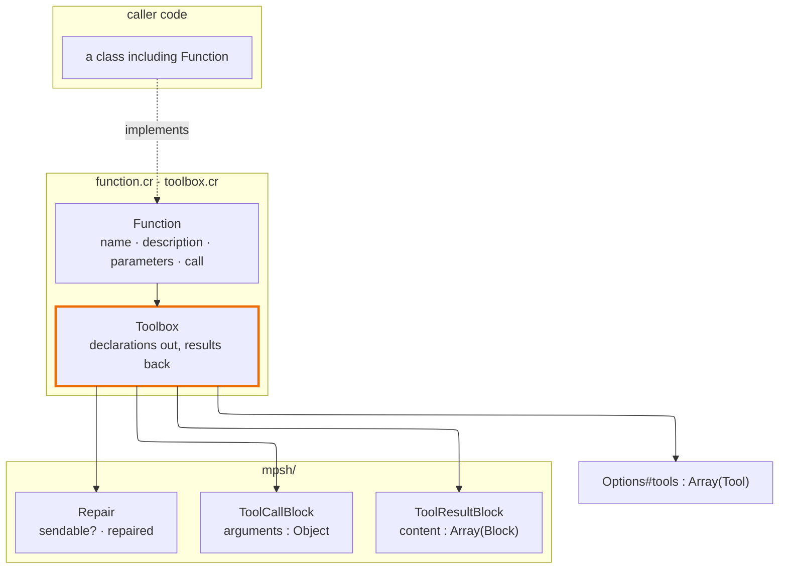

# Tool execution

How a caller supplies tools this shard can run, and what was decided along the
way. The library half is built; what the `elelem` command does with a tool call
is a separate question, still open, and lives in
[CLI_DESIGN.md](./CLI_DESIGN.md).

## The gap this closes

`Tool` was always a declaration with no behaviour: a name, a description, and a
JSON Schema in text, handed to `Options` and mapped onto the wire. Nothing in
this shard could *run* one. `Client#send`'s turn loop is caller-owned by design,
so the caller was left to pair results to calls, catch whatever a tool raised,
and remember that a cut turn's calls must not be dispatched — three chances to
produce an unsendable session, in every consumer.

`Function` is a declaration plus its handler. `Toolbox` is a collection of them,
used at both ends of a turn.

```crystal
toolbox = Elelem::Toolbox.new([Weather.new, Clock.new] of Elelem::Function)

loop do
  reply, _ = client.send(session, model, options: Options.new(tools: toolbox.tools))
  session << reply

  results = toolbox.dispatch(reply)
  break unless results
  session << results
end
```

`#tools` on the way out, `#dispatch` on the way back, and `nil` from `#dispatch`
is the loop's exit condition. The toolbox does not own the session, does not
decide when a conversation is finished, and does not loop.

## Layering



It depends on `mpsh/` and on `Tool` in `options.cr`, and on nothing in the live
layer — which is why a `Toolbox` can be built and tested without a `Client`, and
why `spec/toolbox_spec.cr` needs no transcript. It is required last in
`src/elelem.cr` because it is the only place this shard runs code it did not
write.

## What was decided, and why

### A tool result is `Array(Block)`, not a new type

The first draft of this proposal carried a `Reply` type with `Text`, `Image`,
`File` and `Audio` variants, to keep a tool's return value free of any one
protocol's idea of what a tool may return. The instinct was right and the work
was already done: `ToolResultBlock#content` is `Array(Block)`, and its comment
says why — *the single decision that makes an image-returning tool
representable at all*.

A second content type would have meant two places that must agree about what a
tool can return, only one of which the mappers understand. The translation
between them would have been written once and then drifted, which is the exact
failure `Capability::Carrier` was extracted to fix.

An inline image needs no URL type either. `Payload` keeps media type and byte
size beside the base64 and synthesizes a `data:` URI at map time for the two
protocols that want one, because *concatenation is trivial; parsing a URI back
out is not*.

### Arguments arrive parsed

`call` takes an `MPSH::Object`, not a JSON string. By the time a reply exists
the exporter has already parsed the arguments; handing over a string would mean
serializing something parsed so that it could be parsed again, and `block.cr`
says which direction fails.

`MPSH::Value` is a real union rather than a `JSON::Any`, deliberately, so a
function reaches into arguments with `as?(String)` and there is no wire identity
left to re-inspect. This is the one part of the contract that reliably surprises
people, because every other Crystal JSON API hands back a parse artifact.

### Schemas stay text

`Tool#parameters` is a `String` and `Function#parameters` matches it. Schemas
arrive already serialized from MCP servers and config files, and a caller
generating one from a Crystal type can hand over the result without this shard
knowing how it was made. Accepting any object with `#to_json` would also make
mapping depend on caller code, and
`spec/conformance/determinism_spec.cr` asserts mapping is a pure function
because prefix caching depends on it.

### No output schema

MCP function definitions carry one; none of the four protocols here consumes
one. A field with nowhere to go is a field every mapper has to explain ignoring.
It can arrive as a declared capability when a protocol wants it.

### Tools live in `Options`, never in `Session`

Asked directly during design, and refused for the reason `options.cr` already
gives: a stored conversation carrying its own tool list has acquired a home, and
portability is the thing this shard refuses to give up. A `Function` is Crystal
code; a JSON archive cannot express one. So a session that carried tools would
either drop them on save — worse — or stop being portable.

### Failure has one shape, provisionally

`Function::Failure` is raised by a tool that ran and could not do the job; its
message reaches the model. Anything else a tool raises is caught and recorded as
a dispatch that blew up.

Two pulls conflict here and both are real. Every tool failing in one shape is
what stops a model learning a different error dialect per tool. But no single
shape survives contact with every tool. This is the cheap answer, kept until the
CLI has real tools to be opinionated about — recorded as a tension rather than a
settled question, so whoever revisits it knows it was seen.

**`is_error` and `exception` are not interchangeable**, and the asymmetry is
sharper than `block.cr`'s comment suggests. `is_error` is carried by the
mappers; `exception` is written by `Archive` and read back, and **nowhere else**.
So `exception` is what a later reader of the archive sees and `is_error` is what
the model sees. A tool reporting failure sets only the first. An unplanned raise
must set *both*, or a tool crashes and the model is never told.

### Sequential, synchronous, no scheduler

Calls run in the order they arrived, one at a time. No protocol here expresses a
dependency between parallel calls — they are a batch issued from one plan, not a
sequence — so running them in order is a superset of what any of them
guarantees.

Failure isolation does not need a fiber: it needs `rescue`, and `#dispatch`
rescues. **Timeouts are the argument that would pull a scheduler forward**, and
they are a real one — a tool that hangs hangs the turn, and bounding that needs
`spawn`, a `Channel` and `select ... timeout`. Two things argue for waiting:
Crystal's fibers are cooperative on one thread by default, so spawning buys real
overlap only for IO-bound tools; and this shard's entire testing story is
deterministic replay, which concurrent dispatch would make considerably harder
to keep.

### One type, not a function and a runner

A `Function` handing out a per-call `Runner` was considered and declined. It
does not enforce statelessness — a function can hold mutable state and pass it
to whatever it mints — so it buys a convention with two types instead of one.
What it *would* buy is somewhere to put per-call context: a deadline, a
cancellation token, a scoped logger. None of that exists in a sequential,
synchronous v1.

The retrofit is cheap, which is what makes waiting safe. Per-call context
belongs in a second parameter rather than a factory, and a module can supply the
delegation:

```crystal
def call(arguments : MPSH::Object, context : Context) : Array(MPSH::Block)
  call(arguments)
end
```

Every existing tool keeps compiling. A factory has no equivalent escape hatch.

**The hazard is named on `#call` instead.** A `Toolbox` holds instances and is
usually built once per process, so an instance variable written during `call`
does not leak between calls within a turn — it leaks between *sessions*, which
surfaces as one conversation seeing another's data.

## What `Toolbox` enforces so callers cannot get it wrong

1. **Duplicate names raise at construction.** A call names one tool; silently
   preferring either is worse than declining to start, and the ambiguity
   surfaces before a model ever calls the contested name.
2. **Every call gets a result** — including a call naming a tool the box does
   not hold, and a call whose tool raised. Skipping either leaves a dangling
   call and an unsendable session.
3. **Dispatch reads the repaired reply.** `#dispatch` repairs its argument
   rather than trusting it, so the rule from
   [CLI_DESIGN.md](./CLI_DESIGN.md)'s *The durable announcement lands after
   repair, not after `finish`* cannot be got wrong by a caller who has not read
   it. Repair is idempotent, so passing an already-repaired message is free.
4. **Server-executed calls are skipped.** The provider ran them and the reply
   carries their results; running them again would be a second, unasked-for
   execution of somebody's side effect.

A detail worth knowing before changing `#dispatch`: `Repair.repaired` returns
`nil` when the call *was* the whole message, so a cut reply holding nothing but
a tool call leaves no message to append and nothing to dispatch. Those are the
same fact, and `#dispatch` reports it as the same `nil` a reply with no calls
produces. The `return nil unless repaired` guard is live, not defensive.

## What this does not answer

Whether `elelem start` and `elelem continue` declare tools at all, and what the
executable would run if they did. Declaring and executing turned out to be one
decision rather than two — see the *Tool execution* entry under
[CLI_DESIGN.md](./CLI_DESIGN.md)'s *Deliberately deferred, not forgotten* — and
what the terminal prints while a call is in flight is settled there already.
